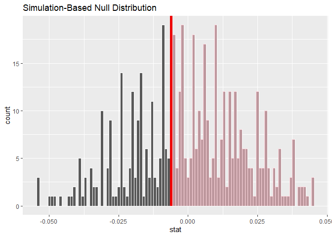
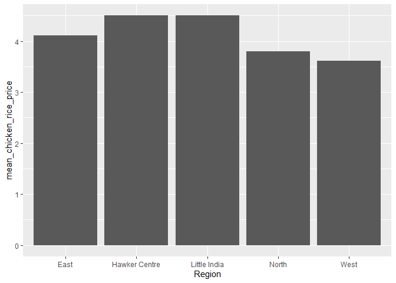

Hypothesis testing prices
================
Jia Xin
3/18/2020

``` r
library(tidyverse)
```

    ## -- Attaching packages --------------------------------------- tidyverse 1.2.1 --

    ## v ggplot2 3.2.1     v purrr   0.3.3
    ## v tibble  2.1.3     v dplyr   0.8.3
    ## v tidyr   1.0.0     v stringr 1.4.0
    ## v readr   1.3.1     v forcats 0.4.0

    ## -- Conflicts ------------------------------------------ tidyverse_conflicts() --
    ## x dplyr::filter() masks stats::filter()
    ## x dplyr::lag()    masks stats::lag()

``` r
library(googlesheets4)
library(janitor)
```

    ## 
    ## Attaching package: 'janitor'

    ## The following objects are masked from 'package:stats':
    ## 
    ##     chisq.test, fisher.test

``` r
library(lubridate) # this package is part of tidyverse but not loaded by default
```

    ## 
    ## Attaching package: 'lubridate'

    ## The following object is masked from 'package:base':
    ## 
    ##     date

``` r
library(repurrrsive)
library(tools)

library(tmap)
library(sf)
```

    ## Linking to GEOS 3.6.1, GDAL 2.2.3, PROJ 4.9.3

``` r
library(geojsonsf)
library(ggmap)
```

    ## Warning: package 'ggmap' was built under R version 3.6.2

    ## Google's Terms of Service: https://cloud.google.com/maps-platform/terms/.

    ## Please cite ggmap if you use it! See citation("ggmap") for details.

``` r
library(mapview)

library(httr)
library(osmdata)
```

    ## Data (c) OpenStreetMap contributors, ODbL 1.0. http://www.openstreetmap.org/copyright

``` r
library(dplyr)
library(stringr)

library(forcats)
library(infer)
```

    ## Warning: package 'infer' was built under R version 3.6.2

# Hypothesis testing of grocery shop prices

\*Check mean prices and change order if needed

``` r
grocery_shops_prices <- read.csv("data/grocery_shops_price_test.csv")
```

## (1) Testing for basket of goods

1 basket = 10 eggs, 5kg rice, 3kg potatoes, 3kg onions, 1kg dhal, 1kg
curry powder

``` r
grocery_shops_prices_basket_cleaned <- grocery_shops_prices %>%
  filter(Basket.price != "NA")
```

``` r
#Mean price of basket
mean_basket_price_region <- grocery_shops_prices_basket_cleaned %>%
  group_by(Region) %>% 
  summarise (mean_basket_price = mean (Basket.price)) %>%
  arrange(mean_basket_price)
```

``` r
#Mean price of basket visually
mean_basket_price_region %>%
  ggplot(aes(x = Region, y = mean_basket_price)) + geom_col()
```

<!-- -->

### (a) Between supermarkets/Little India and shops near dorms

Hypothesis: The prices in shops far from the dorms are significantly
lower than those of shops near dorms

``` r
grocery_shops_prices_basket_cleaned %>%
  filter (Position == "Near dorm" | Position == "Far dorm") %>%
  group_by (Position) %>%
  summarise (mean_basket = mean(Basket.price))
```

    ## # A tibble: 2 x 2
    ##   Position  mean_basket
    ##   <fct>           <dbl>
    ## 1 Far dorm         36.2
    ## 2 Near dorm        37.7

``` r
mean_diff_basket_near_far <- grocery_shops_prices_basket_cleaned %>%
  filter (Position == "Near dorm" | Position == "Far dorm") %>% 
  specify(formula = Basket.price ~ Position) %>% 
  calculate(stat = "diff in means", order = c("Near dorm", "Far dorm"))
```

``` r
null_distribution_basket_near_far <- grocery_shops_prices_basket_cleaned %>%
  filter (Position == "Near dorm" | Position == "Far dorm") %>% 
  specify(formula = Basket.price ~ Position) %>%  
  hypothesize(null = "independence") %>% 
  generate(reps = 500, type = "permute") %>% 
  calculate(stat = "diff in means", order = c("Near dorm", "Far dorm"))
```

``` r
null_distribution_basket_near_far %>% 
  get_pvalue(obs_stat = mean_diff_basket_near_far, direction = "greater")
```

    ## # A tibble: 1 x 1
    ##   p_value
    ##     <dbl>
    ## 1   0.214

### (b) Between supermarkets and shops outside dorms

Hypothesis: The prices in supermarkets are significantly lower than
those of shops near dorms

``` r
grocery_shops_prices_basket_cleaned %>%
  filter (Remarks == "Outside dorm" | Remarks == "Supermarket") %>%
  group_by (Remarks) %>%
  summarise (mean_basket = mean(Basket.price))
```

    ## # A tibble: 2 x 2
    ##   Remarks      mean_basket
    ##   <fct>              <dbl>
    ## 1 Outside dorm        36.9
    ## 2 Supermarket         34.5

``` r
mean_diff_basket_SM_outside <- grocery_shops_prices_basket_cleaned %>%
  filter (Remarks == "Outside dorm" | Remarks == "Supermarket") %>% 
  specify(formula = Basket.price ~ Remarks) %>% 
  calculate(stat = "diff in means", order = c("Outside dorm", "Supermarket"))
```

``` r
null_distribution_basket_SM_outside <- grocery_shops_prices_basket_cleaned %>%
  filter (Remarks == "Outside dorm" | Remarks == "Supermarket") %>%  
  specify(formula = Basket.price ~ Remarks) %>%  
  hypothesize(null = "independence") %>% 
  generate(reps = 500, type = "permute") %>% 
  calculate(stat = "diff in means", order = c("Outside dorm", "Supermarket"))
```

``` r
null_distribution_basket_SM_outside %>% 
  get_pvalue(obs_stat = mean_diff_basket_SM_outside, direction = "greater")
```

    ## # A tibble: 1 x 1
    ##   p_value
    ##     <dbl>
    ## 1   0.214

### (c) Between supermarkets and shops in dorms

Hypothesis: The prices in supermarkets are significantly lower than
those of shops in dorms

``` r
grocery_shops_prices_basket_cleaned %>%
  filter (Remarks == "Within dorm" | Remarks == "Supermarket") %>%
  group_by (Remarks) %>%
  summarise (mean_basket = mean(Basket.price))
```

    ## # A tibble: 2 x 2
    ##   Remarks     mean_basket
    ##   <fct>             <dbl>
    ## 1 Supermarket        34.5
    ## 2 Within dorm        38.7

``` r
mean_diff_basket_SM_inside <- grocery_shops_prices_basket_cleaned %>%
  filter (Remarks == "Within dorm" | Remarks == "Supermarket") %>% 
  specify(formula = Basket.price~ Remarks) %>% 
  calculate(stat = "diff in means", order = c("Within dorm", "Supermarket"))
```

``` r
null_distribution_basket_SM_inside <- grocery_shops_prices_basket_cleaned %>%
  filter (Remarks == "Within dorm" | Remarks == "Supermarket") %>%  
  specify(formula = Basket.price ~ Remarks) %>%  
  hypothesize(null = "independence") %>% 
  generate(reps = 500, type = "permute") %>% 
  calculate(stat = "diff in means", order = c("Within dorm", "Supermarket"))
```

``` r
null_distribution_basket_SM_inside %>% 
  get_pvalue(obs_stat = mean_diff_basket_SM_inside, direction = "greater")
```

    ## # A tibble: 1 x 1
    ##   p_value
    ##     <dbl>
    ## 1   0.058

### (d) Between Little India and shops outside dorms

Hypothesis: The prices in Little India are significantly lower than
those of shops near dorms

``` r
grocery_shops_prices_basket_cleaned %>%
  filter (Remarks == "Outside dorm" | Remarks == "Little India") %>%
  group_by (Remarks) %>%
  summarise (mean_basket = mean(Basket.price))
```

    ## # A tibble: 2 x 2
    ##   Remarks      mean_basket
    ##   <fct>              <dbl>
    ## 1 Little India        38.9
    ## 2 Outside dorm        36.9

``` r
mean_diff_basket_LI_outside <- grocery_shops_prices_basket_cleaned %>%
  filter (Remarks == "Outside dorm" | Remarks == "Little India") %>% 
  specify(formula = Basket.price ~ Remarks) %>% 
  calculate(stat = "diff in means", order = c("Little India", "Outside dorm"))
```

``` r
null_distribution_basket_LI_outside <- grocery_shops_prices_basket_cleaned %>%
  filter (Remarks == "Outside dorm" | Remarks == "Little India") %>%  
  specify(formula = Basket.price ~ Remarks) %>%  
  hypothesize(null = "independence") %>% 
  generate(reps = 500, type = "permute") %>% 
  calculate(stat = "diff in means", order = c("Little India", "Outside dorm"))
```

``` r
null_distribution_basket_LI_outside %>% 
  get_pvalue(obs_stat = mean_diff_basket_LI_outside, direction = "greater")
```

    ## # A tibble: 1 x 1
    ##   p_value
    ##     <dbl>
    ## 1   0.312

### (e) Between Little India and shops in dorms

Hypothesis: The prices in Little India are significantly lower than
those of shops in dorms

``` r
grocery_shops_prices_basket_cleaned %>%
  filter (Remarks == "Within dorm" | Remarks == "Little India") %>%
  group_by (Remarks) %>%
  summarise (mean_basket = mean(Basket.price))
```

    ## # A tibble: 2 x 2
    ##   Remarks      mean_basket
    ##   <fct>              <dbl>
    ## 1 Little India        38.9
    ## 2 Within dorm         38.7

``` r
mean_diff_basket_LI_inside <- grocery_shops_prices_basket_cleaned %>%
  filter (Remarks == "Within dorm" | Remarks == "Little India") %>% 
  specify(formula = Basket.price ~ Remarks) %>% 
  calculate(stat = "diff in means", order = c("Little India", "Within dorm"))
```

``` r
null_distribution_basket_LI_inside <- grocery_shops_prices_basket_cleaned %>%
  filter (Remarks == "Within dorm" | Remarks == "Little India") %>%  
  specify(formula = Basket.price ~ Remarks) %>%  
  hypothesize(null = "independence") %>% 
  generate(reps = 500, type = "permute") %>% 
  calculate(stat = "diff in means", order = c("Little India", "Within dorm"))
```

``` r
null_distribution_basket_LI_inside %>% 
  get_pvalue(obs_stat = mean_diff_basket_LI_inside, direction = "greater")
```

    ## # A tibble: 1 x 1
    ##   p_value
    ##     <dbl>
    ## 1   0.458

### (f) Between shops in dorms and shops outside dorm

``` r
grocery_shops_prices_basket_cleaned %>%
  filter (Remarks == "Within dorm" | Remarks == "Outside dorm") %>%
  group_by (Remarks) %>%
  summarise (mean_basket = mean(Basket.price))
```

    ## # A tibble: 2 x 2
    ##   Remarks      mean_basket
    ##   <fct>              <dbl>
    ## 1 Outside dorm        36.9
    ## 2 Within dorm         38.7

``` r
mean_diff_basket_outside_inside <- grocery_shops_prices_basket_cleaned %>%
  filter (Remarks == "Within dorm" | Remarks == "Outside dorm") %>% 
  specify(formula = Basket.price ~ Remarks) %>% 
  calculate(stat = "diff in means", order = c("Within dorm", "Outside dorm"))
```

``` r
null_distribution_basket_outside_inside <- grocery_shops_prices_basket_cleaned %>%
  filter (Remarks == "Within dorm" | Remarks == "Outside dorm") %>%  
  specify(formula = Basket.price ~ Remarks) %>%  
  hypothesize(null = "independence") %>% 
  generate(reps = 500, type = "permute") %>% 
  calculate(stat = "diff in means", order = c("Within dorm", "Outside dorm"))
```

``` r
null_distribution_basket_outside_inside %>% 
  get_pvalue(obs_stat = mean_diff_basket_outside_inside, direction = "greater")
```

    ## # A tibble: 1 x 1
    ##   p_value
    ##     <dbl>
    ## 1   0.164

## (2) Testing for eggs

``` r
grocery_shops_prices_egg_cleaned <- grocery_shops_prices %>%
  filter(Price.of.1.egg != "NA")
```

``` r
#Mean price of egg
mean_egg_price_region <- grocery_shops_prices_egg_cleaned %>%
  group_by(Region) %>% 
  summarise (mean_egg_price = mean (Price.of.1.egg)) %>%
  arrange(mean_egg_price)
```

``` r
#Mean price of egg visually
mean_egg_price_region %>%
  arrange(mean_egg_price) %>%
  ggplot(aes(x = Region, y = mean_egg_price)) + geom_col()
```

<!-- -->

### (a) Between supermarkets/Little India and shops near dorms

Hypothesis: The prices in shops far from the dorms are significantly
lower than those of shops near dorms

``` r
grocery_shops_prices_egg_cleaned %>%
  filter (Position == "Near dorm" | Position == "Far dorm") %>%
  group_by (Position) %>%
  summarise (mean_egg = mean(Price.of.1.egg))
```

    ## # A tibble: 2 x 2
    ##   Position  mean_egg
    ##   <fct>        <dbl>
    ## 1 Far dorm     0.156
    ## 2 Near dorm    0.175

``` r
mean_diff_egg_near_far <- grocery_shops_prices_egg_cleaned %>%
  filter (Position == "Near dorm" | Position == "Far dorm") %>% 
  specify(formula = Price.of.1.egg ~ Position) %>% 
  calculate(stat = "diff in means", order = c("Near dorm", "Far dorm"))

mean_diff_egg_near_far
```

    ## # A tibble: 1 x 1
    ##     stat
    ##    <dbl>
    ## 1 0.0191

``` r
null_distribution_egg_near_far <- grocery_shops_prices_egg_cleaned %>%
  filter (Position == "Near dorm" | Position == "Far dorm") %>% 
  specify(formula = Price.of.1.egg ~ Position) %>%  
  hypothesize(null = "independence") %>% 
  generate(reps = 500, type = "permute") %>% 
  calculate(stat = "diff in means", order = c("Near dorm", "Far dorm"))
```

``` r
null_distribution_egg_near_far %>% 
  get_pvalue(obs_stat = mean_diff_egg_near_far, direction = "greater")
```

    ## # A tibble: 1 x 1
    ##   p_value
    ##     <dbl>
    ## 1   0.074

### (b) Between supermarkets and shops outside dorms

Hypothesis: The prices in supermarkets are significantly lower than
those of shops near dorms

``` r
grocery_shops_prices_egg_cleaned %>%
  filter (Remarks == "Outside dorm" | Remarks == "Supermarket") %>%
  group_by (Remarks) %>%
  summarise (mean_egg = mean(Price.of.1.egg))
```

    ## # A tibble: 2 x 2
    ##   Remarks      mean_egg
    ##   <fct>           <dbl>
    ## 1 Outside dorm    0.168
    ## 2 Supermarket     0.138

``` r
mean_diff_egg_SM_outside <- grocery_shops_prices_egg_cleaned %>%
  filter (Remarks == "Outside dorm" | Remarks == "Supermarket") %>% 
  specify(formula = Price.of.1.egg ~ Remarks) %>% 
  calculate(stat = "diff in means", order = c("Outside dorm", "Supermarket"))

mean_diff_egg_SM_outside
```

    ## # A tibble: 1 x 1
    ##     stat
    ##    <dbl>
    ## 1 0.0296

``` r
null_distribution_egg_SM_outside <- grocery_shops_prices_egg_cleaned %>%
  filter (Remarks == "Outside dorm" | Remarks == "Supermarket") %>%  
  specify(formula = Price.of.1.egg ~ Remarks) %>%  
  hypothesize(null = "independence") %>% 
  generate(reps = 500, type = "permute") %>% 
  calculate(stat = "diff in means", order = c("Outside dorm", "Supermarket"))
```

``` r
null_distribution_egg_SM_outside %>% 
  get_pvalue(obs_stat = mean_diff_egg_SM_outside, direction = "greater")
```

    ## # A tibble: 1 x 1
    ##   p_value
    ##     <dbl>
    ## 1   0.084

### (c) Between supermarkets and shops in dorms

Hypothesis: The prices in supermarkets are significantly lower than
those of shops in dorms

``` r
grocery_shops_prices_egg_cleaned %>%
  filter (Remarks == "Within dorm" | Remarks == "Supermarket") %>%
  group_by (Remarks) %>%
  summarise (mean_egg = mean(Price.of.1.egg))
```

    ## # A tibble: 2 x 2
    ##   Remarks     mean_egg
    ##   <fct>          <dbl>
    ## 1 Supermarket    0.138
    ## 2 Within dorm    0.184

``` r
mean_diff_egg_SM_inside <- grocery_shops_prices_egg_cleaned %>%
  filter (Remarks == "Within dorm" | Remarks == "Supermarket") %>% 
  specify(formula = Price.of.1.egg ~ Remarks) %>% 
  calculate(stat = "diff in means", order = c("Within dorm", "Supermarket"))

mean_diff_egg_SM_inside
```

    ## # A tibble: 1 x 1
    ##     stat
    ##    <dbl>
    ## 1 0.0462

``` r
null_distribution_egg_SM_inside <- grocery_shops_prices_egg_cleaned %>%
  filter (Remarks == "Within dorm" | Remarks == "Supermarket") %>%  
  specify(formula = Price.of.1.egg ~ Remarks) %>%  
  hypothesize(null = "independence") %>% 
  generate(reps = 500, type = "permute") %>% 
  calculate(stat = "diff in means", order = c("Within dorm", "Supermarket"))
```

``` r
null_distribution_egg_SM_inside %>% 
  get_pvalue(obs_stat = mean_diff_egg_SM_inside, direction = "greater")
```

    ## # A tibble: 1 x 1
    ##   p_value
    ##     <dbl>
    ## 1   0.002

``` r
null_distribution_egg_SM_inside %>% 
  visualise(bins = 100) +
  shade_p_value(obs_stat = mean_diff_egg_SM_inside, direction = "greater")
```

<!-- -->

### (d) Between Little India and shops outside dorms

Hypothesis: The prices in Little India are significantly lower than
those of shops near dorms

``` r
grocery_shops_prices_egg_cleaned %>%
  filter (Remarks == "Outside dorm" | Remarks == "Little India") %>%
  group_by (Remarks) %>%
  summarise (mean_egg = mean(Price.of.1.egg))
```

    ## # A tibble: 2 x 2
    ##   Remarks      mean_egg
    ##   <fct>           <dbl>
    ## 1 Little India    0.174
    ## 2 Outside dorm    0.168

``` r
mean_diff_egg_LI_outside <- grocery_shops_prices_egg_cleaned %>%
  filter (Remarks == "Outside dorm" | Remarks == "Little India") %>% 
  specify(formula = Price.of.1.egg ~ Remarks) %>% 
  calculate(stat = "diff in means", order = c("Outside dorm", "Little India"))

mean_diff_egg_LI_outside
```

    ## # A tibble: 1 x 1
    ##       stat
    ##      <dbl>
    ## 1 -0.00604

``` r
null_distribution_egg_LI_outside <- grocery_shops_prices_egg_cleaned %>%
  filter (Remarks == "Outside dorm" | Remarks == "Little India") %>%  
  specify(formula = Price.of.1.egg ~ Remarks) %>%  
  hypothesize(null = "independence") %>% 
  generate(reps = 500, type = "permute") %>% 
  calculate(stat = "diff in means", order = c("Outside dorm", "Little India"))
```

``` r
null_distribution_egg_LI_outside %>% 
  get_pvalue(obs_stat = mean_diff_egg_LI_outside, direction = "greater")
```

    ## # A tibble: 1 x 1
    ##   p_value
    ##     <dbl>
    ## 1   0.634

``` r
null_distribution_egg_LI_outside %>% 
  visualise(bins = 100) +
  shade_p_value(obs_stat = mean_diff_egg_LI_outside, direction = "greater")
```

<!-- -->

### (e) Between Little India and shops in dorms

Hypothesis: The prices in Little India are significantly lower than
those of shops in dorms

``` r
grocery_shops_prices_egg_cleaned %>%
  filter (Remarks == "Within dorm" | Remarks == "Little India") %>%
  group_by (Remarks) %>%
  summarise (mean_egg = mean(Price.of.1.egg))
```

    ## # A tibble: 2 x 2
    ##   Remarks      mean_egg
    ##   <fct>           <dbl>
    ## 1 Little India    0.174
    ## 2 Within dorm     0.184

``` r
mean_diff_egg_LI_inside <- grocery_shops_prices_egg_cleaned %>%
  filter (Remarks == "Within dorm" | Remarks == "Little India") %>% 
  specify(formula = Price.of.1.egg ~ Remarks) %>% 
  calculate(stat = "diff in means", order = c("Within dorm", "Little India"))

mean_diff_egg_LI_inside
```

    ## # A tibble: 1 x 1
    ##     stat
    ##    <dbl>
    ## 1 0.0105

``` r
null_distribution_egg_LI_inside <- grocery_shops_prices_egg_cleaned %>%
  filter (Remarks == "Within dorm" | Remarks == "Little India") %>%  
  specify(formula = Price.of.1.egg ~ Remarks) %>%  
  hypothesize(null = "independence") %>% 
  generate(reps = 500, type = "permute") %>% 
  calculate(stat = "diff in means", order = c("Within dorm", "Little India"))
```

``` r
null_distribution_egg_LI_inside %>% 
  get_pvalue(obs_stat = mean_diff_egg_LI_inside, direction = "greater")
```

    ## # A tibble: 1 x 1
    ##   p_value
    ##     <dbl>
    ## 1   0.282

### (f) Between shops in dorms and shops outside dorm

``` r
grocery_shops_prices_egg_cleaned %>%
  filter (Remarks == "Within dorm" | Remarks == "Outside dorm") %>%
  group_by (Remarks) %>%
  summarise (mean_egg = mean(Price.of.1.egg))
```

    ## # A tibble: 2 x 2
    ##   Remarks      mean_egg
    ##   <fct>           <dbl>
    ## 1 Outside dorm    0.168
    ## 2 Within dorm     0.184

``` r
mean_diff_egg_outside_inside <- grocery_shops_prices_egg_cleaned %>%
  filter (Remarks == "Within dorm" | Remarks == "Outside dorm") %>% 
  specify(formula = Price.of.1.egg ~ Remarks) %>% 
  calculate(stat = "diff in means", order = c("Within dorm", "Outside dorm"))

mean_diff_egg_outside_inside
```

    ## # A tibble: 1 x 1
    ##     stat
    ##    <dbl>
    ## 1 0.0165

``` r
null_distribution_egg_outside_inside <- grocery_shops_prices_egg_cleaned %>%
  filter (Remarks == "Within dorm" | Remarks == "Outside dorm") %>%  
  specify(formula = Price.of.1.egg ~ Remarks) %>%  
  hypothesize(null = "independence") %>% 
  generate(reps = 500, type = "permute") %>% 
  calculate(stat = "diff in means", order = c("Within dorm", "Outside dorm"))
```

``` r
null_distribution_egg_outside_inside %>% 
  get_pvalue(obs_stat = mean_diff_egg_outside_inside, direction = "greater")
```

    ## # A tibble: 1 x 1
    ##   p_value
    ##     <dbl>
    ## 1    0.06

## (3) Testing for rice

``` r
grocery_shops_prices_rice_cleaned <- grocery_shops_prices %>%
  filter(Price.of.rice.kg != "NA")
```

``` r
#Mean price of rice
mean_rice_price_region <- grocery_shops_prices_rice_cleaned %>%
  group_by(Region) %>% 
  summarise (mean_rice_price = mean (Price.of.rice.kg)) %>%
  arrange(mean_rice_price)
```

``` r
#Mean price of egg visually
mean_rice_price_region %>%
  arrange(mean_rice_price) %>%
  ggplot(aes(x = Region, y = mean_rice_price)) + geom_col()
```

<!-- -->

### (a) Between supermarkets/Little India and shops near dorms

Hypothesis: The prices in shops far from the dorms are significantly
lower than those of shops near dorms

``` r
grocery_shops_prices_rice_cleaned %>%
  filter (Position == "Near dorm" | Position == "Far dorm") %>%
  group_by (Position) %>%
  summarise (mean_rice = mean(Price.of.rice.kg))
```

    ## # A tibble: 2 x 2
    ##   Position  mean_rice
    ##   <fct>         <dbl>
    ## 1 Far dorm       1.42
    ## 2 Near dorm      1.42

``` r
mean_diff_rice_near_far <- grocery_shops_prices_rice_cleaned %>%
  filter (Position == "Near dorm" | Position == "Far dorm") %>% 
  specify(formula = Price.of.rice.kg ~ Position) %>% 
  calculate(stat = "diff in means", order = c("Near dorm", "Far dorm"))

mean_diff_rice_near_far
```

    ## # A tibble: 1 x 1
    ##      stat
    ##     <dbl>
    ## 1 0.00615

``` r
null_distribution_rice_near_far <- grocery_shops_prices_rice_cleaned %>%
  filter (Position == "Near dorm" | Position == "Far dorm") %>% 
  specify(formula = Price.of.rice.kg ~ Position) %>%  
  hypothesize(null = "independence") %>% 
  generate(reps = 500, type = "permute") %>% 
  calculate(stat = "diff in means", order = c("Near dorm", "Far dorm"))
```

``` r
null_distribution_rice_near_far %>% 
  get_pvalue(obs_stat = mean_diff_rice_near_far, direction = "greater")
```

    ## # A tibble: 1 x 1
    ##   p_value
    ##     <dbl>
    ## 1   0.506

### (b) Between supermarkets and shops outside dorms

Hypothesis: The prices in supermarkets are significantly lower than
those of shops near dorms

``` r
grocery_shops_prices_rice_cleaned %>%
  filter (Remarks == "Outside dorm" | Remarks == "Supermarket") %>%
  group_by (Remarks) %>%
  summarise (mean_rice = mean(Price.of.rice.kg))
```

    ## # A tibble: 2 x 2
    ##   Remarks      mean_rice
    ##   <fct>            <dbl>
    ## 1 Outside dorm      1.42
    ## 2 Supermarket       1.27

``` r
mean_diff_rice_SM_outside <- grocery_shops_prices_rice_cleaned %>%
  filter (Remarks == "Outside dorm" | Remarks == "Supermarket") %>% 
  specify(formula = Price.of.rice.kg ~ Remarks) %>% 
  calculate(stat = "diff in means", order = c("Outside dorm", "Supermarket"))

mean_diff_rice_SM_outside
```

    ## # A tibble: 1 x 1
    ##    stat
    ##   <dbl>
    ## 1 0.152

``` r
null_distribution_rice_SM_outside <- grocery_shops_prices_rice_cleaned %>%
  filter (Remarks == "Outside dorm" | Remarks == "Supermarket") %>%  
  specify(formula = Price.of.rice.kg ~ Remarks) %>%  
  hypothesize(null = "independence") %>% 
  generate(reps = 500, type = "permute") %>% 
  calculate(stat = "diff in means", order = c("Outside dorm", "Supermarket"))
```

``` r
null_distribution_rice_SM_outside %>% 
  get_pvalue(obs_stat = mean_diff_rice_SM_outside, direction = "greater")
```

    ## # A tibble: 1 x 1
    ##   p_value
    ##     <dbl>
    ## 1   0.052

### (c) Between supermarkets and shops in dorms

Hypothesis: The prices in supermarkets are significantly lower than
those of shops in dorms

``` r
grocery_shops_prices_rice_cleaned %>%
  filter (Remarks == "Within dorm" | Remarks == "Supermarket") %>%
  group_by (Remarks) %>%
  summarise (mean_rice = mean(Price.of.rice.kg))
```

    ## # A tibble: 2 x 2
    ##   Remarks     mean_rice
    ##   <fct>           <dbl>
    ## 1 Supermarket      1.27
    ## 2 Within dorm      1.42

``` r
mean_diff_rice_SM_inside <- grocery_shops_prices_rice_cleaned %>%
  filter (Remarks == "Within dorm" | Remarks == "Supermarket") %>% 
  specify(formula = Price.of.rice.kg ~ Remarks) %>% 
  calculate(stat = "diff in means", order = c("Within dorm", "Supermarket"))

mean_diff_rice_SM_inside
```

    ## # A tibble: 1 x 1
    ##    stat
    ##   <dbl>
    ## 1 0.155

``` r
null_distribution_rice_SM_inside <- grocery_shops_prices_rice_cleaned %>%
  filter (Remarks == "Within dorm" | Remarks == "Supermarket") %>%  
  specify(formula = Price.of.rice.kg ~ Remarks) %>%  
  hypothesize(null = "independence") %>% 
  generate(reps = 500, type = "permute") %>% 
  calculate(stat = "diff in means", order = c("Within dorm", "Supermarket"))
```

``` r
null_distribution_rice_SM_inside %>% 
  get_pvalue(obs_stat = mean_diff_rice_SM_inside, direction = "greater")
```

    ## # A tibble: 1 x 1
    ##   p_value
    ##     <dbl>
    ## 1   0.046

``` r
null_distribution_rice_SM_inside %>% 
  visualise(bins = 100) +
  shade_p_value(obs_stat = mean_diff_rice_SM_inside, direction = "greater")
```

<!-- -->

### (d) Between Little India and shops outside dorms

Hypothesis: The prices in Little India are significantly lower than
those of shops near dorms

``` r
grocery_shops_prices_rice_cleaned %>%
  filter (Remarks == "Outside dorm" | Remarks == "Little India") %>%
  group_by (Remarks) %>%
  summarise (mean_rice = mean(Price.of.rice.kg))
```

    ## # A tibble: 2 x 2
    ##   Remarks      mean_rice
    ##   <fct>            <dbl>
    ## 1 Little India      1.64
    ## 2 Outside dorm      1.42

``` r
mean_diff_rice_LI_outside <- grocery_shops_prices_rice_cleaned %>%
  filter (Remarks == "Outside dorm" | Remarks == "Little India") %>% 
  specify(formula = Price.of.rice.kg ~ Remarks) %>% 
  calculate(stat = "diff in means", order = c("Outside dorm", "Little India"))

mean_diff_rice_LI_outside
```

    ## # A tibble: 1 x 1
    ##     stat
    ##    <dbl>
    ## 1 -0.216

``` r
null_distribution_rice_LI_outside <- grocery_shops_prices_rice_cleaned %>%
  filter (Remarks == "Outside dorm" | Remarks == "Little India") %>%  
  specify(formula = Price.of.rice.kg ~ Remarks) %>%  
  hypothesize(null = "independence") %>% 
  generate(reps = 500, type = "permute") %>% 
  calculate(stat = "diff in means", order = c("Outside dorm", "Little India"))
```

``` r
null_distribution_rice_LI_outside %>% 
  get_pvalue(obs_stat = mean_diff_rice_LI_outside, direction = "greater")
```

    ## # A tibble: 1 x 1
    ##   p_value
    ##     <dbl>
    ## 1   0.838

### (e) Between Little India and shops in dorms

Hypothesis: The prices in Little India are significantly lower than
those of shops in dorms

``` r
grocery_shops_prices_rice_cleaned %>%
  filter (Remarks == "Within dorm" | Remarks == "Little India") %>%
  group_by (Remarks) %>%
  summarise (mean_rice = mean(Price.of.rice.kg))
```

    ## # A tibble: 2 x 2
    ##   Remarks      mean_rice
    ##   <fct>            <dbl>
    ## 1 Little India      1.64
    ## 2 Within dorm       1.42

``` r
mean_diff_rice_LI_inside <- grocery_shops_prices_rice_cleaned %>%
  filter (Remarks == "Within dorm" | Remarks == "Little India") %>% 
  specify(formula = Price.of.rice.kg ~ Remarks) %>% 
  calculate(stat = "diff in means", order = c("Within dorm", "Little India"))

mean_diff_rice_LI_inside
```

    ## # A tibble: 1 x 1
    ##     stat
    ##    <dbl>
    ## 1 -0.213

``` r
null_distribution_rice_LI_inside <- grocery_shops_prices_rice_cleaned %>%
  filter (Remarks == "Within dorm" | Remarks == "Little India") %>%  
  specify(formula = Price.of.rice.kg ~ Remarks) %>%  
  hypothesize(null = "independence") %>% 
  generate(reps = 500, type = "permute") %>% 
  calculate(stat = "diff in means", order = c("Within dorm", "Little India"))
```

``` r
null_distribution_rice_LI_inside %>% 
  get_pvalue(obs_stat = mean_diff_rice_LI_inside, direction = "greater")
```

    ## # A tibble: 1 x 1
    ##   p_value
    ##     <dbl>
    ## 1   0.888

### (f) Between shops in dorms and shops outside dorm

``` r
grocery_shops_prices_rice_cleaned %>%
  filter (Remarks == "Within dorm" | Remarks == "Outside dorm") %>%
  group_by (Remarks) %>%
  summarise (mean_rice = mean(Price.of.rice.kg))
```

    ## # A tibble: 2 x 2
    ##   Remarks      mean_rice
    ##   <fct>            <dbl>
    ## 1 Outside dorm      1.42
    ## 2 Within dorm       1.42

``` r
mean_diff_rice_outside_inside <- grocery_shops_prices_rice_cleaned %>%
  filter (Remarks == "Within dorm" | Remarks == "Outside dorm") %>% 
  specify(formula = Price.of.rice.kg ~ Remarks) %>% 
  calculate(stat = "diff in means", order = c("Within dorm", "Outside dorm"))

mean_diff_rice_outside_inside
```

    ## # A tibble: 1 x 1
    ##      stat
    ##     <dbl>
    ## 1 0.00283

``` r
null_distribution_rice_outside_inside <- grocery_shops_prices_rice_cleaned %>%
  filter (Remarks == "Within dorm" | Remarks == "Outside dorm") %>%  
  specify(formula = Price.of.rice.kg ~ Remarks) %>%  
  hypothesize(null = "independence") %>% 
  generate(reps = 500, type = "permute") %>% 
  calculate(stat = "diff in means", order = c("Within dorm", "Outside dorm"))
```

``` r
null_distribution_rice_outside_inside %>% 
  get_pvalue(obs_stat = mean_diff_rice_outside_inside, direction = "greater")
```

    ## # A tibble: 1 x 1
    ##   p_value
    ##     <dbl>
    ## 1   0.492

## (4) Testing for curry powder

``` r
grocery_shops_prices_curry_cleaned <- grocery_shops_prices %>%
  filter(Price.of.curry.powder.kg != "NA")
```

``` r
#Mean price of curry
mean_curry_price_region <- grocery_shops_prices_curry_cleaned %>%
  group_by(Region) %>% 
  summarise (mean_curry_price = mean (Price.of.curry.powder.kg)) %>%
  arrange(mean_curry_price)
```

``` r
#Mean price of curry visually
mean_curry_price_region %>%
  arrange(mean_curry_price) %>%
  ggplot(aes(x = Region, y = mean_curry_price)) + geom_col()
```

<!-- -->

### (a) Between supermarkets/Little India and shops near dorms

Hypothesis: The prices in shops far from the dorms are significantly
lower than those of shops near dorms

``` r
grocery_shops_prices_curry_cleaned %>%
  filter (Position == "Near dorm" | Position == "Far dorm") %>%
  group_by (Position) %>%
  summarise (mean_rice = mean(Price.of.curry.powder.kg))
```

    ## # A tibble: 2 x 2
    ##   Position  mean_rice
    ##   <fct>         <dbl>
    ## 1 Far dorm       6.97
    ## 2 Near dorm      7.99

``` r
mean_diff_curry_near_far <- grocery_shops_prices_curry_cleaned %>%
  filter (Position == "Near dorm" | Position == "Far dorm") %>% 
  specify(formula = Price.of.curry.powder.kg ~ Position) %>% 
  calculate(stat = "diff in means", order = c("Near dorm", "Far dorm"))
```

``` r
null_distribution_curry_near_far <- grocery_shops_prices_curry_cleaned %>%
  filter (Position == "Near dorm" | Position == "Far dorm") %>% 
  specify(formula = Price.of.curry.powder.kg ~ Position) %>%  
  hypothesize(null = "independence") %>% 
  generate(reps = 500, type = "permute") %>% 
  calculate(stat = "diff in means", order = c("Near dorm", "Far dorm"))
```

``` r
null_distribution_curry_near_far %>% 
  get_pvalue(obs_stat = mean_diff_curry_near_far, direction = "greater")
```

    ## # A tibble: 1 x 1
    ##   p_value
    ##     <dbl>
    ## 1   0.088

### (b) Between supermarkets and shops outside dorms

Hypothesis: The prices in supermarkets are significantly lower than
those of shops near dorms

``` r
grocery_shops_prices_curry_cleaned %>%
  filter (Remarks == "Outside dorm" | Remarks == "Supermarket") %>%
  group_by (Remarks) %>%
  summarise (mean_curry = mean(Price.of.curry.powder.kg))
```

    ## # A tibble: 2 x 2
    ##   Remarks      mean_curry
    ##   <fct>             <dbl>
    ## 1 Outside dorm       7.92
    ## 2 Supermarket        6.6

``` r
mean_diff_curry_SM_outside <- grocery_shops_prices_curry_cleaned %>%
  filter (Remarks == "Outside dorm" | Remarks == "Supermarket") %>% 
  specify(formula = Price.of.curry.powder.kg ~ Remarks) %>% 
  calculate(stat = "diff in means", order = c("Outside dorm", "Supermarket"))
```

``` r
null_distribution_curry_SM_outside <- grocery_shops_prices_curry_cleaned %>%
  filter (Remarks == "Outside dorm" | Remarks == "Supermarket") %>%  
  specify(formula = Price.of.curry.powder.kg ~ Remarks) %>%  
  hypothesize(null = "independence") %>% 
  generate(reps = 500, type = "permute") %>% 
  calculate(stat = "diff in means", order = c("Outside dorm", "Supermarket"))
```

``` r
null_distribution_curry_SM_outside %>% 
  get_pvalue(obs_stat = mean_diff_curry_SM_outside, direction = "greater")
```

    ## # A tibble: 1 x 1
    ##   p_value
    ##     <dbl>
    ## 1    0.11

### (c) Between supermarkets and shops in dorms

Hypothesis: The prices in supermarkets are significantly lower than
those of shops in dorms

``` r
grocery_shops_prices_curry_cleaned %>%
  filter (Remarks == "Within dorm" | Remarks == "Supermarket") %>%
  group_by (Remarks) %>%
  summarise (mean_curry = mean(Price.of.curry.powder.kg))
```

    ## # A tibble: 2 x 2
    ##   Remarks     mean_curry
    ##   <fct>            <dbl>
    ## 1 Supermarket       6.6 
    ## 2 Within dorm       8.09

``` r
mean_diff_curry_SM_inside <- grocery_shops_prices_curry_cleaned %>%
  filter (Remarks == "Within dorm" | Remarks == "Supermarket") %>% 
  specify(formula = Price.of.curry.powder.kg ~ Remarks) %>% 
  calculate(stat = "diff in means", order = c("Within dorm", "Supermarket"))
```

``` r
null_distribution_curry_SM_inside <- grocery_shops_prices_curry_cleaned %>%
  filter (Remarks == "Within dorm" | Remarks == "Supermarket") %>%  
  specify(formula = Price.of.curry.powder.kg ~ Remarks) %>%  
  hypothesize(null = "independence") %>% 
  generate(reps = 500, type = "permute") %>% 
  calculate(stat = "diff in means", order = c("Within dorm", "Supermarket"))
```

``` r
null_distribution_curry_SM_inside %>% 
  get_pvalue(obs_stat = mean_diff_curry_SM_inside, direction = "greater")
```

    ## # A tibble: 1 x 1
    ##   p_value
    ##     <dbl>
    ## 1   0.004

### (d) Between Little India and shops outside dorms

Hypothesis: The prices in Little India are significantly lower than
those of shops near dorms

``` r
grocery_shops_prices_curry_cleaned %>%
  filter (Remarks == "Outside dorm" | Remarks == "Little India") %>%
  group_by (Remarks) %>%
  summarise (mean_curry = mean(Price.of.curry.powder.kg))
```

    ## # A tibble: 2 x 2
    ##   Remarks      mean_curry
    ##   <fct>             <dbl>
    ## 1 Little India       7.33
    ## 2 Outside dorm       7.92

``` r
mean_diff_curry_LI_outside <- grocery_shops_prices_curry_cleaned %>%
  filter (Remarks == "Outside dorm" | Remarks == "Little India") %>% 
  specify(formula = Price.of.curry.powder.kg ~ Remarks) %>% 
  calculate(stat = "diff in means", order = c("Outside dorm", "Little India"))
```

``` r
null_distribution_curry_LI_outside <- grocery_shops_prices_curry_cleaned %>%
  filter (Remarks == "Outside dorm" | Remarks == "Little India") %>%  
  specify(formula = Price.of.curry.powder.kg ~ Remarks) %>%  
  hypothesize(null = "independence") %>% 
  generate(reps = 500, type = "permute") %>% 
  calculate(stat = "diff in means", order = c("Outside dorm", "Little India"))
```

``` r
null_distribution_curry_LI_outside %>% 
  get_pvalue(obs_stat = mean_diff_curry_LI_outside, direction = "greater")
```

    ## # A tibble: 1 x 1
    ##   p_value
    ##     <dbl>
    ## 1   0.336

### (e) Between Little India and shops in dorms

Hypothesis: The prices in Little India are significantly lower than
those of shops in dorms

``` r
grocery_shops_prices_curry_cleaned %>%
  filter (Remarks == "Within dorm" | Remarks == "Little India") %>%
  group_by (Remarks) %>%
  summarise (mean_curry = mean(Price.of.curry.powder.kg))
```

    ## # A tibble: 2 x 2
    ##   Remarks      mean_curry
    ##   <fct>             <dbl>
    ## 1 Little India       7.33
    ## 2 Within dorm        8.09

``` r
mean_diff_curry_LI_inside <- grocery_shops_prices_curry_cleaned %>%
  filter (Remarks == "Within dorm" | Remarks == "Little India") %>% 
  specify(formula = Price.of.curry.powder.kg ~ Remarks) %>% 
  calculate(stat = "diff in means", order = c("Within dorm", "Little India"))
```

``` r
null_distribution_curry_LI_inside <- grocery_shops_prices_curry_cleaned %>%
  filter (Remarks == "Within dorm" | Remarks == "Little India") %>%  
  specify(formula = Price.of.curry.powder.kg ~ Remarks) %>%  
  hypothesize(null = "independence") %>% 
  generate(reps = 500, type = "permute") %>% 
  calculate(stat = "diff in means", order = c("Within dorm", "Little India"))
```

``` r
null_distribution_curry_LI_inside %>% 
  get_pvalue(obs_stat = mean_diff_curry_LI_inside, direction = "greater")
```

    ## # A tibble: 1 x 1
    ##   p_value
    ##     <dbl>
    ## 1   0.222

### (f) Between shops in dorms and shops outside dorm

``` r
grocery_shops_prices_curry_cleaned %>%
  filter (Remarks == "Within dorm" | Remarks == "Outside dorm") %>%
  group_by (Remarks) %>%
  summarise (mean_curry = mean(Price.of.curry.powder.kg))
```

    ## # A tibble: 2 x 2
    ##   Remarks      mean_curry
    ##   <fct>             <dbl>
    ## 1 Outside dorm       7.92
    ## 2 Within dorm        8.09

``` r
mean_diff_curry_outside_inside <- grocery_shops_prices_curry_cleaned %>%
  filter (Remarks == "Within dorm" | Remarks == "Outside dorm") %>% 
  specify(formula = Price.of.curry.powder.kg ~ Remarks) %>% 
  calculate(stat = "diff in means", order = c("Within dorm", "Outside dorm"))
```

``` r
null_distribution_curry_outside_inside <- grocery_shops_prices_curry_cleaned %>%
  filter (Remarks == "Within dorm" | Remarks == "Outside dorm") %>%  
  specify(formula = Price.of.curry.powder.kg ~ Remarks) %>%  
  hypothesize(null = "independence") %>% 
  generate(reps = 500, type = "permute") %>% 
  calculate(stat = "diff in means", order = c("Within dorm", "Outside dorm"))
```

``` r
null_distribution_curry_outside_inside %>% 
  get_pvalue(obs_stat = mean_diff_curry_outside_inside, direction = "greater")
```

    ## # A tibble: 1 x 1
    ##   p_value
    ##     <dbl>
    ## 1   0.396

## (5) Testing for dhal

``` r
grocery_shops_prices_dhal_cleaned <- grocery_shops_prices %>%
  filter(Price.of.dhal.kg != "NA")
```

``` r
#Mean price of dhal
mean_dhal_price_region <- grocery_shops_prices_dhal_cleaned %>%
  group_by(Region) %>% 
  summarise (mean_dhal_price = mean (Price.of.dhal.kg)) %>%
  arrange(mean_dhal_price)
```

``` r
#Mean price of egg visually
mean_dhal_price_region %>%
  arrange(mean_dhal_price) %>%
  ggplot(aes(x = Region, y = mean_dhal_price)) + geom_col()
```

<!-- -->

### (a) Between supermarkets/Little India and shops near dorms

Hypothesis: The prices in shops far from the dorms are significantly
lower than those of shops near dorms

``` r
grocery_shops_prices_dhal_cleaned %>%
  filter (Position == "Near dorm" | Position == "Far dorm") %>%
  group_by (Position) %>%
  summarise (mean_dhal = mean(Price.of.dhal.kg))
```

    ## # A tibble: 2 x 2
    ##   Position  mean_dhal
    ##   <fct>         <dbl>
    ## 1 Far dorm       3.95
    ## 2 Near dorm      3.65

``` r
mean_diff_dhal_near_far <- grocery_shops_prices_dhal_cleaned %>%
  filter (Position == "Near dorm" | Position == "Far dorm") %>% 
  specify(formula = Price.of.dhal.kg ~ Position) %>% 
  calculate(stat = "diff in means", order = c("Near dorm", "Far dorm"))
```

``` r
null_distribution_dhal_near_far <- grocery_shops_prices_dhal_cleaned %>%
  filter (Position == "Near dorm" | Position == "Far dorm") %>% 
  specify(formula = Price.of.dhal.kg ~ Position) %>%  
  hypothesize(null = "independence") %>% 
  generate(reps = 500, type = "permute") %>% 
  calculate(stat = "diff in means", order = c("Near dorm", "Far dorm"))
```

``` r
null_distribution_dhal_near_far %>% 
  get_pvalue(obs_stat = mean_diff_dhal_near_far, direction = "greater")
```

    ## # A tibble: 1 x 1
    ##   p_value
    ##     <dbl>
    ## 1   0.758

### (b) Between supermarkets and shops outside dorms

Hypothesis: The prices in supermarkets are significantly lower than
those of shops near dorms

``` r
grocery_shops_prices_dhal_cleaned %>%
  filter (Remarks == "Outside dorm" | Remarks == "Supermarket") %>%
  group_by (Remarks) %>%
  summarise (mean_dhal = mean(Price.of.dhal.kg))
```

    ## # A tibble: 2 x 2
    ##   Remarks      mean_dhal
    ##   <fct>            <dbl>
    ## 1 Outside dorm      3.53
    ## 2 Supermarket       4.5

``` r
mean_diff_dhal_SM_outside <- grocery_shops_prices_dhal_cleaned %>%
  filter (Remarks == "Outside dorm" | Remarks == "Supermarket") %>% 
  specify(formula = Price.of.dhal.kg ~ Remarks) %>% 
  calculate(stat = "diff in means", order = c("Outside dorm", "Supermarket"))
```

``` r
null_distribution_dhal_SM_outside <- grocery_shops_prices_dhal_cleaned %>%
  filter (Remarks == "Outside dorm" | Remarks == "Supermarket") %>%  
  specify(formula = Price.of.dhal.kg ~ Remarks) %>%  
  hypothesize(null = "independence") %>% 
  generate(reps = 500, type = "permute") %>% 
  calculate(stat = "diff in means", order = c("Outside dorm", "Supermarket"))
```

``` r
null_distribution_dhal_SM_outside %>% 
  get_pvalue(obs_stat = mean_diff_dhal_SM_outside, direction = "greater")
```

    ## # A tibble: 1 x 1
    ##   p_value
    ##     <dbl>
    ## 1   0.898

### (c) Between supermarkets and shops in dorms

Hypothesis: The prices in supermarkets are significantly lower than
those of shops in dorms

``` r
grocery_shops_prices_dhal_cleaned %>%
  filter (Remarks == "Within dorm" | Remarks == "Supermarket") %>%
  group_by (Remarks) %>%
  summarise (mean_dhal = mean(Price.of.dhal.kg))
```

    ## # A tibble: 2 x 2
    ##   Remarks     mean_dhal
    ##   <fct>           <dbl>
    ## 1 Supermarket      4.5 
    ## 2 Within dorm      3.81

``` r
mean_diff_dhal_SM_inside <- grocery_shops_prices_dhal_cleaned %>%
  filter (Remarks == "Within dorm" | Remarks == "Supermarket") %>% 
  specify(formula = Price.of.dhal.kg ~ Remarks) %>% 
  calculate(stat = "diff in means", order = c("Within dorm", "Supermarket"))
```

``` r
null_distribution_dhal_SM_inside <- grocery_shops_prices_dhal_cleaned %>%
  filter (Remarks == "Within dorm" | Remarks == "Supermarket") %>%  
  specify(formula = Price.of.dhal.kg ~ Remarks) %>%  
  hypothesize(null = "independence") %>% 
  generate(reps = 500, type = "permute") %>% 
  calculate(stat = "diff in means", order = c("Within dorm", "Supermarket"))
```

``` r
null_distribution_dhal_SM_inside %>% 
  get_pvalue(obs_stat = mean_diff_dhal_SM_inside, direction = "greater")
```

    ## # A tibble: 1 x 1
    ##   p_value
    ##     <dbl>
    ## 1   0.882

### (d) Between Little India and shops outside dorms

Hypothesis: The prices in Little India are significantly lower than
those of shops near dorms

``` r
grocery_shops_prices_dhal_cleaned %>%
  filter (Remarks == "Outside dorm" | Remarks == "Little India") %>%
  group_by (Remarks) %>%
  summarise (mean_dhal = mean(Price.of.dhal.kg))
```

    ## # A tibble: 2 x 2
    ##   Remarks      mean_dhal
    ##   <fct>            <dbl>
    ## 1 Little India      3.4 
    ## 2 Outside dorm      3.53

``` r
mean_diff_dhal_LI_outside <- grocery_shops_prices_dhal_cleaned %>%
  filter (Remarks == "Outside dorm" | Remarks == "Little India") %>% 
  specify(formula = Price.of.dhal.kg ~ Remarks) %>% 
  calculate(stat = "diff in means", order = c("Outside dorm", "Little India"))
```

``` r
null_distribution_dhal_LI_outside <- grocery_shops_prices_dhal_cleaned %>%
  filter (Remarks == "Outside dorm" | Remarks == "Little India") %>%  
  specify(formula = Price.of.dhal.kg ~ Remarks) %>%  
  hypothesize(null = "independence") %>% 
  generate(reps = 500, type = "permute") %>% 
  calculate(stat = "diff in means", order = c("Outside dorm", "Little India"))
```

``` r
null_distribution_dhal_LI_outside %>% 
  get_pvalue(obs_stat = mean_diff_dhal_LI_outside, direction = "greater")
```

    ## # A tibble: 1 x 1
    ##   p_value
    ##     <dbl>
    ## 1   0.498

### (e) Between Little India and shops in dorms

Hypothesis: The prices in Little India are significantly lower than
those of shops in dorms

``` r
grocery_shops_prices_dhal_cleaned %>%
  filter (Remarks == "Within dorm" | Remarks == "Little India") %>%
  group_by (Remarks) %>%
  summarise (mean_dhal = mean(Price.of.dhal.kg))
```

    ## # A tibble: 2 x 2
    ##   Remarks      mean_dhal
    ##   <fct>            <dbl>
    ## 1 Little India      3.4 
    ## 2 Within dorm       3.81

``` r
mean_diff_dhal_LI_inside <- grocery_shops_prices_dhal_cleaned %>%
  filter (Remarks == "Within dorm" | Remarks == "Little India") %>% 
  specify(formula = Price.of.dhal.kg ~ Remarks) %>% 
  calculate(stat = "diff in means", order = c("Within dorm", "Little India"))
```

``` r
null_distribution_dhal_LI_inside <- grocery_shops_prices_dhal_cleaned %>%
  filter (Remarks == "Within dorm" | Remarks == "Little India") %>%  
  specify(formula = Price.of.dhal.kg ~ Remarks) %>%  
  hypothesize(null = "independence") %>% 
  generate(reps = 500, type = "permute") %>% 
  calculate(stat = "diff in means", order = c("Within dorm", "Little India"))
```

``` r
null_distribution_dhal_LI_inside %>% 
  get_pvalue(obs_stat = mean_diff_dhal_LI_inside, direction = "greater")
```

    ## # A tibble: 1 x 1
    ##   p_value
    ##     <dbl>
    ## 1   0.192

### (f) Between shops in dorms and shops outside dorm

``` r
grocery_shops_prices_dhal_cleaned %>%
  filter (Remarks == "Within dorm" | Remarks == "Outside dorm") %>%
  group_by (Remarks) %>%
  summarise (mean_dhal = mean(Price.of.dhal.kg))
```

    ## # A tibble: 2 x 2
    ##   Remarks      mean_dhal
    ##   <fct>            <dbl>
    ## 1 Outside dorm      3.53
    ## 2 Within dorm       3.81

``` r
mean_diff_dhal_outside_inside <- grocery_shops_prices_dhal_cleaned %>%
  filter (Remarks == "Within dorm" | Remarks == "Outside dorm") %>% 
  specify(formula = Price.of.dhal.kg ~ Remarks) %>% 
  calculate(stat = "diff in means", order = c("Within dorm", "Outside dorm"))
```

``` r
null_distribution_dhal_outside_inside <- grocery_shops_prices_dhal_cleaned %>%
  filter (Remarks == "Within dorm" | Remarks == "Outside dorm") %>%  
  specify(formula = Price.of.dhal.kg ~ Remarks) %>%  
  hypothesize(null = "independence") %>% 
  generate(reps = 500, type = "permute") %>% 
  calculate(stat = "diff in means", order = c("Within dorm", "Outside dorm"))
```

``` r
null_distribution_dhal_outside_inside %>% 
  get_pvalue(obs_stat = mean_diff_dhal_outside_inside, direction = "greater")
```

    ## # A tibble: 1 x 1
    ##   p_value
    ##     <dbl>
    ## 1   0.132

## (6) Testing for onions

``` r
grocery_shops_prices_onions_cleaned <- grocery_shops_prices %>%
  filter(Price.of.onions.kg != "NA")
```

``` r
#Mean price of onion
mean_onion_price_region <- grocery_shops_prices_onions_cleaned %>%
  group_by(Region) %>% 
  summarise (mean_onion_price = mean (Price.of.onions.kg)) %>%
  arrange(mean_onion_price)
```

``` r
#Mean price of onion visually
mean_onion_price_region %>%
  arrange(mean_onion_price) %>%
  ggplot(aes(x = Region, y = mean_onion_price)) + geom_col()
```

<!-- -->

### (a) Between supermarkets/Little India and shops near dorms

Hypothesis: The prices in shops far from the dorms are significantly
lower than those of shops near dorms

``` r
grocery_shops_prices_onions_cleaned %>%
  filter (Position == "Near dorm" | Position == "Far dorm") %>%
  group_by (Position) %>%
  summarise (mean_onions = mean(Price.of.onions.kg))
```

    ## # A tibble: 2 x 2
    ##   Position  mean_onions
    ##   <fct>           <dbl>
    ## 1 Far dorm         3.74
    ## 2 Near dorm        2.91

``` r
mean_diff_onions_near_far <- grocery_shops_prices_onions_cleaned %>%
  filter (Position == "Near dorm" | Position == "Far dorm") %>% 
  specify(formula = Price.of.onions.kg ~ Position) %>% 
  calculate(stat = "diff in means", order = c("Near dorm", "Far dorm"))
```

``` r
null_distribution_onions_near_far <- grocery_shops_prices_onions_cleaned %>%
  filter (Position == "Near dorm" | Position == "Far dorm") %>% 
  specify(formula = Price.of.onions.kg ~ Position) %>%  
  hypothesize(null = "independence") %>% 
  generate(reps = 500, type = "permute") %>% 
  calculate(stat = "diff in means", order = c("Near dorm", "Far dorm"))
```

``` r
null_distribution_onions_near_far %>% 
  get_pvalue(obs_stat = mean_diff_onions_near_far, direction = "greater")
```

    ## # A tibble: 1 x 1
    ##   p_value
    ##     <dbl>
    ## 1   0.922

### (b) Between supermarkets and shops outside dorms

Hypothesis: The prices in supermarkets are significantly lower than
those of shops near dorms

``` r
grocery_shops_prices_onions_cleaned %>%
  filter (Remarks == "Outside dorm" | Remarks == "Supermarket") %>%
  group_by (Remarks) %>%
  summarise (mean_onions = mean(Price.of.onions.kg))
```

    ## # A tibble: 2 x 2
    ##   Remarks      mean_onions
    ##   <fct>              <dbl>
    ## 1 Outside dorm        2.93
    ## 2 Supermarket         2.84

``` r
mean_diff_onions_SM_outside <- grocery_shops_prices_onions_cleaned %>%
  filter (Remarks == "Outside dorm" | Remarks == "Supermarket") %>% 
  specify(formula = Price.of.onions.kg ~ Remarks) %>% 
  calculate(stat = "diff in means", order = c("Outside dorm", "Supermarket"))
```

``` r
null_distribution_onions_SM_outside <- grocery_shops_prices_onions_cleaned %>%
  filter (Remarks == "Outside dorm" | Remarks == "Supermarket") %>%  
  specify(formula = Price.of.onions.kg ~ Remarks) %>%  
  hypothesize(null = "independence") %>% 
  generate(reps = 500, type = "permute") %>% 
  calculate(stat = "diff in means", order = c("Outside dorm", "Supermarket"))
```

``` r
null_distribution_onions_SM_outside %>% 
  get_pvalue(obs_stat = mean_diff_onions_SM_outside, direction = "greater")
```

    ## # A tibble: 1 x 1
    ##   p_value
    ##     <dbl>
    ## 1   0.454

### (c) Between supermarkets and shops in dorms

Hypothesis: The prices in supermarkets are significantly lower than
those of shops in dorms

``` r
grocery_shops_prices_onions_cleaned %>%
  filter (Remarks == "Within dorm" | Remarks == "Supermarket") %>%
  group_by (Remarks) %>%
  summarise (mean_onions = mean(Price.of.onions.kg))
```

    ## # A tibble: 2 x 2
    ##   Remarks     mean_onions
    ##   <fct>             <dbl>
    ## 1 Supermarket        2.84
    ## 2 Within dorm        2.88

``` r
mean_diff_onions_SM_inside <- grocery_shops_prices_onions_cleaned %>%
  filter (Remarks == "Within dorm" | Remarks == "Supermarket") %>% 
  specify(formula = Price.of.onions.kg ~ Remarks) %>% 
  calculate(stat = "diff in means", order = c("Within dorm", "Supermarket"))
```

``` r
null_distribution_onions_SM_inside <- grocery_shops_prices_onions_cleaned %>%
  filter (Remarks == "Within dorm" | Remarks == "Supermarket") %>%  
  specify(formula = Price.of.onions.kg ~ Remarks) %>%  
  hypothesize(null = "independence") %>% 
  generate(reps = 500, type = "permute") %>% 
  calculate(stat = "diff in means", order = c("Within dorm", "Supermarket"))
```

``` r
null_distribution_onions_SM_inside %>% 
  get_pvalue(obs_stat = mean_diff_onions_SM_inside, direction = "greater")
```

    ## # A tibble: 1 x 1
    ##   p_value
    ##     <dbl>
    ## 1   0.406

### (d) Between Little India and shops outside dorms

Hypothesis: The prices in Little India are significantly lower than
those of shops near dorms

``` r
grocery_shops_prices_onions_cleaned %>%
  filter (Remarks == "Outside dorm" | Remarks == "Little India") %>%
  group_by (Remarks) %>%
  summarise (mean_onions = mean(Price.of.onions.kg))
```

    ## # A tibble: 2 x 2
    ##   Remarks      mean_onions
    ##   <fct>              <dbl>
    ## 1 Little India        4.63
    ## 2 Outside dorm        2.93

``` r
mean_diff_onions_LI_outside <- grocery_shops_prices_onions_cleaned %>%
  filter (Remarks == "Outside dorm" | Remarks == "Little India") %>% 
  specify(formula = Price.of.onions.kg ~ Remarks) %>% 
  calculate(stat = "diff in means", order = c("Outside dorm", "Little India"))
```

``` r
null_distribution_onions_LI_outside <- grocery_shops_prices_onions_cleaned %>%
  filter (Remarks == "Outside dorm" | Remarks == "Little India") %>%  
  specify(formula = Price.of.onions.kg ~ Remarks) %>%  
  hypothesize(null = "independence") %>% 
  generate(reps = 500, type = "permute") %>% 
  calculate(stat = "diff in means", order = c("Outside dorm", "Little India"))
```

``` r
null_distribution_onions_LI_outside %>% 
  get_pvalue(obs_stat = mean_diff_onions_LI_outside, direction = "greater")
```

    ## # A tibble: 1 x 1
    ##   p_value
    ##     <dbl>
    ## 1   0.958

### (e) Between Little India and shops in dorms

Hypothesis: The prices in Little India are significantly lower than
those of shops in dorms

``` r
grocery_shops_prices_onions_cleaned %>%
  filter (Remarks == "Within dorm" | Remarks == "Little India") %>%
  group_by (Remarks) %>%
  summarise (mean_onions = mean(Price.of.onions.kg))
```

    ## # A tibble: 2 x 2
    ##   Remarks      mean_onions
    ##   <fct>              <dbl>
    ## 1 Little India        4.63
    ## 2 Within dorm         2.88

``` r
mean_diff_onions_LI_inside <- grocery_shops_prices_onions_cleaned %>%
  filter (Remarks == "Within dorm" | Remarks == "Little India") %>% 
  specify(formula = Price.of.onions.kg ~ Remarks) %>% 
  calculate(stat = "diff in means", order = c("Within dorm", "Little India"))
```

``` r
null_distribution_onions_LI_inside <- grocery_shops_prices_onions_cleaned %>%
  filter (Remarks == "Within dorm" | Remarks == "Little India") %>%  
  specify(formula = Price.of.onions.kg ~ Remarks) %>%  
  hypothesize(null = "independence") %>% 
  generate(reps = 500, type = "permute") %>% 
  calculate(stat = "diff in means", order = c("Within dorm", "Little India"))
```

``` r
null_distribution_onions_LI_inside %>% 
  get_pvalue(obs_stat = mean_diff_onions_LI_inside, direction = "greater")
```

    ## # A tibble: 1 x 1
    ##   p_value
    ##     <dbl>
    ## 1   0.938

### (f) Between shops in dorms and shops outside dorm

``` r
grocery_shops_prices_onions_cleaned %>%
  filter (Remarks == "Within dorm" | Remarks == "Outside dorm") %>%
  group_by (Remarks) %>%
  summarise (mean_dhal = mean(Price.of.onions.kg))
```

    ## # A tibble: 2 x 2
    ##   Remarks      mean_dhal
    ##   <fct>            <dbl>
    ## 1 Outside dorm      2.93
    ## 2 Within dorm       2.88

``` r
mean_diff_onions_outside_inside <- grocery_shops_prices_onions_cleaned %>%
  filter (Remarks == "Within dorm" | Remarks == "Outside dorm") %>% 
  specify(formula = Price.of.onions.kg ~ Remarks) %>% 
  calculate(stat = "diff in means", order = c("Within dorm", "Outside dorm"))
```

``` r
null_distribution_onions_outside_inside <- grocery_shops_prices_onions_cleaned %>%
  filter (Remarks == "Within dorm" | Remarks == "Outside dorm") %>%  
  specify(formula = Price.of.onions.kg ~ Remarks) %>%  
  hypothesize(null = "independence") %>% 
  generate(reps = 500, type = "permute") %>% 
  calculate(stat = "diff in means", order = c("Within dorm", "Outside dorm"))
```

``` r
null_distribution_onions_outside_inside %>% 
  get_pvalue(obs_stat = mean_diff_onions_outside_inside, direction = "greater")
```

    ## # A tibble: 1 x 1
    ##   p_value
    ##     <dbl>
    ## 1   0.572

## (7) Testing for potatoes

``` r
grocery_shops_prices_potatoes_cleaned <- grocery_shops_prices %>%
  filter(Price.of.potatoes.kg != "NA")
```

``` r
#Mean price of potato
mean_potato_price_region <- grocery_shops_prices_potatoes_cleaned %>%
  group_by(Region) %>% 
  summarise (mean_potato_price = mean (Price.of.potatoes.kg)) %>%
  arrange(mean_potato_price)
```

``` r
#Mean price of onion visually
mean_potato_price_region %>%
  arrange(mean_potato_price) %>%
  ggplot(aes(x = Region, y = mean_potato_price)) + geom_col()
```

<!-- -->

### (a) Between supermarkets/Little India and shops near dorms

Hypothesis: The prices in shops far from the dorms are significantly
lower than those of shops near dorms

``` r
grocery_shops_prices_potatoes_cleaned %>%
  filter (Position == "Near dorm" | Position == "Far dorm") %>%
  group_by (Position) %>%
  summarise (mean_potatoes = mean(Price.of.potatoes.kg))
```

    ## # A tibble: 2 x 2
    ##   Position  mean_potatoes
    ##   <fct>             <dbl>
    ## 1 Far dorm           2.11
    ## 2 Near dorm          1.86

``` r
mean_diff_potatoes_near_far <- grocery_shops_prices_potatoes_cleaned %>%
  filter (Position == "Near dorm" | Position == "Far dorm") %>% 
  specify(formula = Price.of.potatoes.kg ~ Position) %>% 
  calculate(stat = "diff in means", order = c ("Far dorm", "Near dorm"))
```

``` r
null_distribution_potatoes_near_far <- grocery_shops_prices_potatoes_cleaned %>%
  filter (Position == "Near dorm" | Position == "Far dorm") %>% 
  specify(formula = Price.of.potatoes.kg ~ Position) %>%  
  hypothesize(null = "independence") %>% 
  generate(reps = 500, type = "permute") %>% 
  calculate(stat = "diff in means", order = c("Far dorm", "Near dorm"))
```

``` r
null_distribution_potatoes_near_far %>% 
  get_pvalue(obs_stat = mean_diff_potatoes_near_far, direction = "greater")
```

    ## # A tibble: 1 x 1
    ##   p_value
    ##     <dbl>
    ## 1   0.186

### (b) Between supermarkets and shops outside dorms

Hypothesis: The prices in supermarkets are significantly lower than
those of shops near dorms

``` r
grocery_shops_prices_potatoes_cleaned %>%
  filter (Remarks == "Outside dorm" | Remarks == "Supermarket") %>%
  group_by (Remarks) %>%
  summarise (mean_potatoes = mean(Price.of.potatoes.kg))
```

    ## # A tibble: 2 x 2
    ##   Remarks      mean_potatoes
    ##   <fct>                <dbl>
    ## 1 Outside dorm          1.79
    ## 2 Supermarket           1.45

``` r
mean_diff_potatoes_SM_outside <- grocery_shops_prices_potatoes_cleaned %>%
  filter (Remarks == "Outside dorm" | Remarks == "Supermarket") %>% 
  specify(formula = Price.of.potatoes.kg ~ Remarks) %>% 
  calculate(stat = "diff in means", order = c("Outside dorm", "Supermarket"))
```

``` r
null_distribution_potatoes_SM_outside <- grocery_shops_prices_potatoes_cleaned %>%
  filter (Remarks == "Outside dorm" | Remarks == "Supermarket") %>%  
  specify(formula = Price.of.potatoes.kg ~ Remarks) %>%  
  hypothesize(null = "independence") %>% 
  generate(reps = 500, type = "permute") %>% 
  calculate(stat = "diff in means", order = c("Outside dorm", "Supermarket"))
```

``` r
null_distribution_potatoes_SM_outside %>% 
  get_pvalue(obs_stat = mean_diff_potatoes_SM_outside, direction = "greater")
```

    ## # A tibble: 1 x 1
    ##   p_value
    ##     <dbl>
    ## 1   0.228

### (c) Between supermarkets and shops in dorms

Hypothesis: The prices in supermarkets are significantly lower than
those of shops in dorms

``` r
grocery_shops_prices_potatoes_cleaned %>%
  filter (Remarks == "Within dorm" | Remarks == "Supermarket") %>%
  group_by (Remarks) %>%
  summarise (mean_potatoes = mean(Price.of.potatoes.kg))
```

    ## # A tibble: 2 x 2
    ##   Remarks     mean_potatoes
    ##   <fct>               <dbl>
    ## 1 Supermarket          1.45
    ## 2 Within dorm          1.94

``` r
mean_diff_potatoes_SM_inside <- grocery_shops_prices_potatoes_cleaned %>%
  filter (Remarks == "Within dorm" | Remarks == "Supermarket") %>% 
  specify(formula = Price.of.potatoes.kg ~ Remarks) %>% 
  calculate(stat = "diff in means", order = c("Within dorm", "Supermarket"))
```

``` r
null_distribution_potatoes_SM_inside <- grocery_shops_prices_potatoes_cleaned %>%
  filter (Remarks == "Within dorm" | Remarks == "Supermarket") %>%  
  specify(formula = Price.of.potatoes.kg ~ Remarks) %>%  
  hypothesize(null = "independence") %>% 
  generate(reps = 500, type = "permute") %>% 
  calculate(stat = "diff in means", order = c("Within dorm", "Supermarket"))
```

``` r
null_distribution_potatoes_SM_inside %>% 
  get_pvalue(obs_stat = mean_diff_potatoes_SM_inside, direction = "greater")
```

    ## # A tibble: 1 x 1
    ##   p_value
    ##     <dbl>
    ## 1    0.06

### (d) Between Little India and shops outside dorms

Hypothesis: The prices in Little India are significantly lower than
those of shops near dorms

``` r
grocery_shops_prices_potatoes_cleaned %>%
  filter (Remarks == "Outside dorm" | Remarks == "Little India") %>%
  group_by (Remarks) %>%
  summarise (mean_potatoes = mean(Price.of.potatoes.kg))
```

    ## # A tibble: 2 x 2
    ##   Remarks      mean_potatoes
    ##   <fct>                <dbl>
    ## 1 Little India          2.77
    ## 2 Outside dorm          1.79

``` r
mean_diff_potatoes_LI_outside <- grocery_shops_prices_potatoes_cleaned %>%
  filter (Remarks == "Outside dorm" | Remarks == "Little India") %>% 
  specify(formula = Price.of.potatoes.kg ~ Remarks) %>% 
  calculate(stat = "diff in means", order = c("Little India", "Outside dorm"))
```

``` r
null_distribution_potatoes_LI_outside <- grocery_shops_prices_potatoes_cleaned %>%
  filter (Remarks == "Outside dorm" | Remarks == "Little India") %>%  
  specify(formula = Price.of.potatoes.kg ~ Remarks) %>%  
  hypothesize(null = "independence") %>% 
  generate(reps = 500, type = "permute") %>% 
  calculate(stat = "diff in means", order = c("Little India", "Outside dorm"))
```

``` r
null_distribution_potatoes_LI_outside %>% 
  get_pvalue(obs_stat = mean_diff_potatoes_LI_outside, direction = "greater")
```

    ## # A tibble: 1 x 1
    ##   p_value
    ##     <dbl>
    ## 1   0.022

### (e) Between Little India and shops in dorms

Hypothesis: The prices in Little India are significantly lower than
those of shops in dorms

``` r
grocery_shops_prices_potatoes_cleaned %>%
  filter (Remarks == "Within dorm" | Remarks == "Little India") %>%
  group_by (Remarks) %>%
  summarise (mean_potatoes = mean(Price.of.potatoes.kg))
```

    ## # A tibble: 2 x 2
    ##   Remarks      mean_potatoes
    ##   <fct>                <dbl>
    ## 1 Little India          2.77
    ## 2 Within dorm           1.94

``` r
mean_diff_potatoes_LI_inside <- grocery_shops_prices_potatoes_cleaned %>%
  filter (Remarks == "Within dorm" | Remarks == "Little India") %>% 
  specify(formula = Price.of.potatoes.kg ~ Remarks) %>% 
  calculate(stat = "diff in means", order = c("Little India", "Within dorm"))
```

``` r
null_distribution_potatoes_LI_inside <- grocery_shops_prices_potatoes_cleaned %>%
  filter (Remarks == "Within dorm" | Remarks == "Little India") %>%  
  specify(formula = Price.of.potatoes.kg ~ Remarks) %>%  
  hypothesize(null = "independence") %>% 
  generate(reps = 500, type = "permute") %>% 
  calculate(stat = "diff in means", order = c("Little India", "Within dorm"))
```

``` r
null_distribution_potatoes_LI_inside %>% 
  get_pvalue(obs_stat = mean_diff_potatoes_LI_inside, direction = "greater")
```

    ## # A tibble: 1 x 1
    ##   p_value
    ##     <dbl>
    ## 1   0.062

### (f) Between shops in dorms and shops outside dorm

``` r
grocery_shops_prices_potatoes_cleaned %>%
  filter (Remarks == "Within dorm" | Remarks == "Outside dorm") %>%
  group_by (Remarks) %>%
  summarise (mean_potatoes = mean(Price.of.potatoes.kg))
```

    ## # A tibble: 2 x 2
    ##   Remarks      mean_potatoes
    ##   <fct>                <dbl>
    ## 1 Outside dorm          1.79
    ## 2 Within dorm           1.94

``` r
mean_diff_potatoes_outside_inside <- grocery_shops_prices_potatoes_cleaned %>%
  filter (Remarks == "Within dorm" | Remarks == "Outside dorm") %>% 
  specify(formula = Price.of.potatoes.kg ~ Remarks) %>% 
  calculate(stat = "diff in means", order = c("Within dorm", "Outside dorm"))
```

``` r
null_distribution_potatoes_outside_inside <- grocery_shops_prices_potatoes_cleaned %>%
  filter (Remarks == "Within dorm" | Remarks == "Outside dorm") %>%  
  specify(formula = Price.of.potatoes.kg ~ Remarks) %>%  
  hypothesize(null = "independence") %>% 
  generate(reps = 500, type = "permute") %>% 
  calculate(stat = "diff in means", order = c("Within dorm", "Outside dorm"))
```

``` r
null_distribution_potatoes_outside_inside %>% 
  get_pvalue(obs_stat = mean_diff_potatoes_outside_inside, direction = "greater")
```

    ## # A tibble: 1 x 1
    ##   p_value
    ##     <dbl>
    ## 1   0.218

# Hypothesis testing for food outlets prices

``` r
food_prices <- read.csv("data/food_outlets_prices_test.csv")
```

## (1) Testing for Briyani

``` r
food_prices_briyani_cleaned <- food_prices %>%
  filter(Price.of.briyani != "NA")
```

``` r
#Mean price of briyani
mean_briyani_price_region <- food_prices_briyani_cleaned %>%
  group_by(Region) %>% 
  summarise (mean_briyani_price = mean (Price.of.briyani)) %>%
  arrange(mean_briyani_price)
```

``` r
#Mean price of onion visually
mean_briyani_price_region %>%
  arrange(mean_briyani_price) %>%
  ggplot(aes(x = Region, y = mean_briyani_price)) + geom_col()
```

<!-- -->

### (a) Between hawker centre/Little India and shops near dorms

Hypothesis: The prices in shops far from the dorms are significantly
lower than those of shops near dorms

``` r
food_prices_briyani_cleaned %>%
  filter (Position == "Near dorm" | Position == "Far dorm") %>%
  group_by (Position) %>%
  summarise (mean_briyani = mean(Price.of.briyani))
```

    ## # A tibble: 2 x 2
    ##   Position  mean_briyani
    ##   <fct>            <dbl>
    ## 1 Far dorm          5.28
    ## 2 Near dorm         4.83

``` r
mean_diff_briyani_near_far <- food_prices_briyani_cleaned %>%
  filter (Position == "Near dorm" | Position == "Far dorm") %>%
  specify(formula = Price.of.briyani ~ Position) %>% 
  calculate(stat = "diff in means", order = c ("Far dorm", "Near dorm"))
```

``` r
null_distribution_briyani_near_far <- food_prices_briyani_cleaned %>%
  filter (Position == "Near dorm" | Position == "Far dorm") %>% 
  specify(formula = Price.of.briyani ~ Position) %>%  
  hypothesize(null = "independence") %>% 
  generate(reps = 500, type = "permute") %>% 
  calculate(stat = "diff in means", order = c("Far dorm", "Near dorm"))
```

``` r
null_distribution_briyani_near_far %>% 
  get_pvalue(obs_stat = mean_diff_briyani_near_far, direction = "greater")
```

    ## # A tibble: 1 x 1
    ##   p_value
    ##     <dbl>
    ## 1    0.07

### (b) Between hawker centres and shops outside dorms

Hypothesis: The prices in hawker centres are significantly lower than
those of shops near dorms

``` r
food_prices_briyani_cleaned %>%
  filter (Remarks == "Outside dorm" | Remarks == "Hawker Centre") %>%
  group_by (Remarks) %>%
  summarise (mean_briyani = mean(Price.of.briyani))
```

    ## # A tibble: 2 x 2
    ##   Remarks       mean_briyani
    ##   <fct>                <dbl>
    ## 1 Hawker Centre         5   
    ## 2 Outside dorm          4.95

``` r
mean_diff_briyani_HC_outside <- food_prices_briyani_cleaned %>%
  filter (Remarks == "Outside dorm" | Remarks == "Hawker Centre") %>% 
  specify(formula = Price.of.briyani ~ Remarks) %>% 
  calculate(stat = "diff in means", order = c("Outside dorm", "Hawker Centre"))
```

``` r
null_distribution_briyani_HC_outside <- food_prices_briyani_cleaned %>%
  filter (Remarks == "Outside dorm" | Remarks == "Hawker Centre") %>%  
  specify(formula = Price.of.briyani ~ Remarks) %>%  
  hypothesize(null = "independence") %>% 
  generate(reps = 500, type = "permute") %>% 
  calculate(stat = "diff in means", order = c("Outside dorm", "Hawker Centre"))
```

``` r
null_distribution_briyani_HC_outside %>% 
  get_pvalue(obs_stat = mean_diff_briyani_HC_outside, direction = "greater")
```

    ## # A tibble: 1 x 1
    ##   p_value
    ##     <dbl>
    ## 1   0.506

### (c) Between hawker centres and shops in dorms

Hypothesis: The prices in hakwer centres are significantly lower than
those of shops in dorms

``` r
food_prices_briyani_cleaned %>%
  filter (Remarks == "Within dorm" | Remarks == "Hawker Centre") %>%
  group_by (Remarks) %>%
  summarise (mean_briyani = mean(Price.of.briyani))
```

    ## # A tibble: 2 x 2
    ##   Remarks       mean_briyani
    ##   <fct>                <dbl>
    ## 1 Hawker Centre         5   
    ## 2 Within dorm           4.61

``` r
mean_diff_briyani_HC_inside <- food_prices_briyani_cleaned %>%
  filter (Remarks == "Within dorm" | Remarks == "Hawker Centre") %>% 
  specify(formula = Price.of.briyani ~ Remarks) %>% 
  calculate(stat = "diff in means", order = c("Hawker Centre", "Within dorm"))
```

``` r
null_distribution_briyani_HC_inside <- food_prices_briyani_cleaned %>%
  filter (Remarks == "Within dorm" | Remarks == "Hawker Centre") %>%  
  specify(formula = Price.of.briyani ~ Remarks) %>%  
  hypothesize(null = "independence") %>% 
  generate(reps = 500, type = "permute") %>% 
  calculate(stat = "diff in means", order = c("Hawker Centre", "Within dorm"))
```

``` r
null_distribution_briyani_HC_inside %>% 
  get_pvalue(obs_stat = mean_diff_briyani_HC_inside, direction = "greater")
```

    ## # A tibble: 1 x 1
    ##   p_value
    ##     <dbl>
    ## 1   0.222

### (d) Between Little India and shops outside dorms

Hypothesis: The prices in Little India are significantly lower than
those of shops near dorms

``` r
food_prices_briyani_cleaned %>%
  filter (Remarks == "Outside dorm" | Remarks == "Little India") %>%
  group_by (Remarks) %>%
  summarise (mean_briyani = mean(Price.of.briyani))
```

    ## # A tibble: 2 x 2
    ##   Remarks      mean_briyani
    ##   <fct>               <dbl>
    ## 1 Little India         5.5 
    ## 2 Outside dorm         4.95

``` r
mean_diff_briyani_LI_outside <- food_prices_briyani_cleaned %>%
  filter (Remarks == "Outside dorm" | Remarks == "Little India") %>% 
  specify(formula = Price.of.briyani ~ Remarks) %>% 
  calculate(stat = "diff in means", order = c("Little India", "Outside dorm"))
```

``` r
null_distribution_briyani_LI_outside <- food_prices_briyani_cleaned%>%
  filter (Remarks == "Outside dorm" | Remarks == "Little India") %>%  
  specify(formula = Price.of.briyani ~ Remarks) %>%  
  hypothesize(null = "independence") %>% 
  generate(reps = 500, type = "permute") %>% 
  calculate(stat = "diff in means", order = c("Little India", "Outside dorm"))
```

``` r
null_distribution_briyani_LI_outside %>% 
  get_pvalue(obs_stat = mean_diff_briyani_LI_outside, direction = "greater")
```

    ## # A tibble: 1 x 1
    ##   p_value
    ##     <dbl>
    ## 1   0.116

### (e) Between Little India and shops in dorms

Hypothesis: The prices in Little India are significantly lower than
those of shops in dorms

``` r
food_prices_briyani_cleaned %>%
  filter (Remarks == "Within dorm" | Remarks == "Little India") %>%
  group_by (Remarks) %>%
  summarise (mean_briyani = mean(Price.of.briyani))
```

    ## # A tibble: 2 x 2
    ##   Remarks      mean_briyani
    ##   <fct>               <dbl>
    ## 1 Little India         5.5 
    ## 2 Within dorm          4.61

``` r
mean_diff_briyani_LI_inside <- food_prices_briyani_cleaned %>%
  filter (Remarks == "Within dorm" | Remarks == "Little India") %>% 
  specify(formula = Price.of.briyani ~ Remarks) %>% 
  calculate(stat = "diff in means", order = c("Little India", "Within dorm"))
```

``` r
null_distribution_briyani_LI_inside <- food_prices_briyani_cleaned %>%
  filter (Remarks == "Within dorm" | Remarks == "Little India") %>%  
  specify(formula = Price.of.briyani ~ Remarks) %>%  
  hypothesize(null = "independence") %>% 
  generate(reps = 500, type = "permute") %>% 
  calculate(stat = "diff in means", order = c("Little India", "Within dorm"))
```

``` r
null_distribution_briyani_LI_inside %>% 
  get_pvalue(obs_stat = mean_diff_briyani_LI_inside, direction = "greater")
```

    ## # A tibble: 1 x 1
    ##   p_value
    ##     <dbl>
    ## 1   0.036

### (f) Between shops in dorms and shops outside dorm

``` r
food_prices_briyani_cleaned %>%
  filter (Remarks == "Within dorm" | Remarks == "Outside dorm") %>%
  group_by (Remarks) %>%
  summarise (mean_briyani = mean(Price.of.briyani))
```

    ## # A tibble: 2 x 2
    ##   Remarks      mean_briyani
    ##   <fct>               <dbl>
    ## 1 Outside dorm         4.95
    ## 2 Within dorm          4.61

``` r
mean_diff_briyani_outside_inside <- food_prices_briyani_cleaned %>%
  filter (Remarks == "Within dorm" | Remarks == "Outside dorm") %>% 
  specify(formula = Price.of.briyani ~ Remarks) %>% 
  calculate(stat = "diff in means", order = c("Outside dorm", "Within dorm"))
```

``` r
null_distribution_briyani_outside_inside <- food_prices_briyani_cleaned %>%
  filter (Remarks == "Within dorm" | Remarks == "Outside dorm") %>%  
  specify(formula = Price.of.briyani ~ Remarks) %>%  
  hypothesize(null = "independence") %>% 
  generate(reps = 500, type = "permute") %>% 
  calculate(stat = "diff in means", order = c("Outside dorm", "Within dorm"))
```

``` r
null_distribution_briyani_outside_inside %>% 
  get_pvalue(obs_stat = mean_diff_briyani_outside_inside, direction = "greater")
```

    ## # A tibble: 1 x 1
    ##   p_value
    ##     <dbl>
    ## 1    0.13

## (2) Testing for Chicken with rice

``` r
food_prices_chicken_rice_cleaned <- food_prices %>%
  filter(Price.of.rice.with.chicken != "NA")
```

``` r
#Mean price of chicken rice
mean_chicken_rice_price_region <- food_prices_chicken_rice_cleaned %>%
  group_by(Region) %>% 
  summarise (mean_chicken_rice_price = mean (Price.of.rice.with.chicken)) %>%
  arrange(mean_chicken_rice_price)
```

``` r
#Mean price of onion visually
mean_chicken_rice_price_region %>%
  arrange(mean_chicken_rice_price) %>%
  ggplot(aes(x = Region, y = mean_chicken_rice_price)) + geom_col()
```

<!-- -->

### (a) Between hawker centres/Little India and shops near dorms

Hypothesis: The prices in shops far from the dorms are significantly
lower than those of shops near dorms

``` r
food_prices_chicken_rice_cleaned %>%
  filter (Position == "Near dorm" | Position == "Far dorm") %>%
  group_by (Position) %>%
  summarise (mean_chicken_rice = mean(Price.of.rice.with.chicken))
```

    ## # A tibble: 2 x 2
    ##   Position  mean_chicken_rice
    ##   <fct>                 <dbl>
    ## 1 Far dorm               4.5 
    ## 2 Near dorm              3.85

``` r
mean_diff_chicken_rice_near_far <- food_prices_chicken_rice_cleaned %>%
  filter (Position == "Near dorm" | Position == "Far dorm") %>%
  specify(formula = Price.of.rice.with.chicken ~ Position) %>% 
  calculate(stat = "diff in means", order = c ("Far dorm", "Near dorm"))
```

``` r
null_distribution_chicken_rice_near_far <- food_prices_chicken_rice_cleaned %>%
  filter (Position == "Near dorm" | Position == "Far dorm") %>% 
  specify(formula = Price.of.rice.with.chicken ~ Position) %>%
  hypothesize(null = "independence") %>% 
  generate(reps = 500, type = "permute") %>% 
  calculate(stat = "diff in means", order = c("Far dorm", "Near dorm"))
```

``` r
null_distribution_chicken_rice_near_far %>% 
  get_pvalue(obs_stat = mean_diff_chicken_rice_near_far, direction = "greater")
```

    ## # A tibble: 1 x 1
    ##   p_value
    ##     <dbl>
    ## 1   0.022

### (b) Between hawker centres and shops outside dorms

Hypothesis: The prices in hawker centres are significantly lower than
those of shops near dorms

``` r
food_prices_chicken_rice_cleaned %>%
  filter (Remarks == "Outside dorm" | Remarks == "Hawker Centre") %>%
  group_by (Remarks) %>%
  summarise (mean_chicken_rice = mean(Price.of.rice.with.chicken))
```

    ## # A tibble: 2 x 2
    ##   Remarks       mean_chicken_rice
    ##   <fct>                     <dbl>
    ## 1 Hawker Centre              4.5 
    ## 2 Outside dorm               3.88

``` r
mean_diff_chicken_rice_HC_outside <- food_prices_chicken_rice_cleaned %>%
  filter (Remarks == "Outside dorm" | Remarks == "Hawker Centre") %>% 
  specify(formula = Price.of.rice.with.chicken ~ Remarks) %>% 
  calculate(stat = "diff in means", order = c("Hawker Centre", "Outside dorm"))
```

``` r
null_distribution_chicken_rice_HC_outside <- food_prices_chicken_rice_cleaned %>%
  filter (Remarks == "Outside dorm" | Remarks == "Hawker Centre") %>%  
  specify(formula = Price.of.rice.with.chicken ~ Remarks) %>%  
  hypothesize(null = "independence") %>% 
  generate(reps = 500, type = "permute") %>% 
  calculate(stat = "diff in means", order = c("Hawker Centre", "Outside dorm"))
```

``` r
null_distribution_chicken_rice_HC_outside %>% 
  get_pvalue(obs_stat = mean_diff_chicken_rice_HC_outside, direction = "greater")
```

    ## # A tibble: 1 x 1
    ##   p_value
    ##     <dbl>
    ## 1   0.248

### (c) Between hawker centres and shops in dorms

Hypothesis: The prices in hakwer centres are significantly lower than
those of shops in dorms

``` r
food_prices_chicken_rice_cleaned %>%
  filter (Remarks == "Within dorm" | Remarks == "Hawker Centre") %>%
  group_by (Remarks) %>%
  summarise (mean_chicken_rice= mean(Price.of.rice.with.chicken))
```

    ## # A tibble: 2 x 2
    ##   Remarks       mean_chicken_rice
    ##   <fct>                     <dbl>
    ## 1 Hawker Centre              4.5 
    ## 2 Within dorm                3.77

``` r
mean_diff_chicken_rice_HC_inside <- food_prices_chicken_rice_cleaned %>%
  filter (Remarks == "Within dorm" | Remarks == "Hawker Centre") %>% 
  specify(formula = Price.of.rice.with.chicken ~ Remarks) %>% 
  calculate(stat = "diff in means", order = c("Hawker Centre", "Within dorm"))
```

``` r
null_distribution_chicken_rice_HC_inside <- food_prices_chicken_rice_cleaned %>%
  filter (Remarks == "Within dorm" | Remarks == "Hawker Centre") %>%  
  specify(formula = Price.of.rice.with.chicken ~ Remarks) %>%  
  hypothesize(null = "independence") %>% 
  generate(reps = 500, type = "permute") %>% 
  calculate(stat = "diff in means", order = c("Hawker Centre", "Within dorm"))
```

``` r
null_distribution_chicken_rice_HC_inside %>% 
  get_pvalue(obs_stat = mean_diff_chicken_rice_HC_inside, direction = "greater")
```

    ## # A tibble: 1 x 1
    ##   p_value
    ##     <dbl>
    ## 1   0.258

### (d) Between Little India and shops outside dorms

Hypothesis: The prices in Little India are significantly lower than
those of shops near dorms

``` r
food_prices_chicken_rice_cleaned %>%
  filter (Remarks == "Outside dorm" | Remarks == "Little India") %>%
  group_by (Remarks) %>%
  summarise (mean_chicken_rice = mean(Price.of.rice.with.chicken))
```

    ## # A tibble: 2 x 2
    ##   Remarks      mean_chicken_rice
    ##   <fct>                    <dbl>
    ## 1 Little India              4.5 
    ## 2 Outside dorm              3.88

``` r
mean_diff_chicken_rice_LI_outside <- food_prices_chicken_rice_cleaned %>%
  filter (Remarks == "Outside dorm" | Remarks == "Little India") %>% 
  specify(formula = Price.of.rice.with.chicken ~ Remarks) %>% 
  calculate(stat = "diff in means", order = c("Little India", "Outside dorm"))
```

``` r
null_distribution_chicken_rice_LI_outside <- food_prices_chicken_rice_cleaned %>%
  filter (Remarks == "Outside dorm" | Remarks == "Little India") %>%  
  specify(formula = Price.of.rice.with.chicken ~ Remarks) %>%  
  hypothesize(null = "independence") %>% 
  generate(reps = 500, type = "permute") %>% 
  calculate(stat = "diff in means", order = c("Little India", "Outside dorm"))
```

``` r
null_distribution_chicken_rice_LI_outside %>% 
  get_pvalue(obs_stat = mean_diff_chicken_rice_LI_outside, direction = "greater")
```

    ## # A tibble: 1 x 1
    ##   p_value
    ##     <dbl>
    ## 1   0.044

### (e) Between Little India and shops in dorms

Hypothesis: The prices in Little India are significantly lower than
those of shops in dorms

``` r
food_prices_chicken_rice_cleaned %>%
  filter (Remarks == "Within dorm" | Remarks == "Little India") %>%
  group_by (Remarks) %>%
  summarise (mean_chicken_rice = mean(Price.of.rice.with.chicken))
```

    ## # A tibble: 2 x 2
    ##   Remarks      mean_chicken_rice
    ##   <fct>                    <dbl>
    ## 1 Little India              4.5 
    ## 2 Within dorm               3.77

``` r
mean_diff_chicken_rice_LI_inside <- food_prices_chicken_rice_cleaned %>%
  filter (Remarks == "Within dorm" | Remarks == "Little India") %>% 
  specify(formula = Price.of.rice.with.chicken ~ Remarks) %>% 
  calculate(stat = "diff in means", order = c("Little India", "Within dorm"))
```

``` r
null_distribution_chicken_rice_LI_inside <- food_prices_chicken_rice_cleaned %>%
  filter (Remarks == "Within dorm" | Remarks == "Little India") %>%  
  specify(formula = Price.of.rice.with.chicken ~ Remarks) %>%  
  hypothesize(null = "independence") %>% 
  generate(reps = 500, type = "permute") %>% 
  calculate(stat = "diff in means", order = c("Little India", "Within dorm"))
```

``` r
null_distribution_chicken_rice_LI_inside %>% 
  get_pvalue(obs_stat = mean_diff_chicken_rice_LI_inside, direction = "greater")
```

    ## # A tibble: 1 x 1
    ##   p_value
    ##     <dbl>
    ## 1   0.038

### (f) Between shops in dorms and shops outside dorm

``` r
food_prices_chicken_rice_cleaned %>%
  filter (Remarks == "Within dorm" | Remarks == "Outside dorm") %>%
  group_by (Remarks) %>%
  summarise (mean_chicken_rice = mean(Price.of.rice.with.chicken))
```

    ## # A tibble: 2 x 2
    ##   Remarks      mean_chicken_rice
    ##   <fct>                    <dbl>
    ## 1 Outside dorm              3.88
    ## 2 Within dorm               3.77

``` r
mean_diff_chicken_rice_outside_inside <- food_prices_chicken_rice_cleaned %>%
  filter (Remarks == "Within dorm" | Remarks == "Outside dorm") %>% 
  specify(formula = Price.of.rice.with.chicken ~ Remarks) %>% 
  calculate(stat = "diff in means", order = c("Outside dorm", "Within dorm"))
```

``` r
null_distribution_chicken_rice_outside_inside <- food_prices_chicken_rice_cleaned %>%
  filter (Remarks == "Within dorm" | Remarks == "Outside dorm") %>%  
  specify(formula = Price.of.rice.with.chicken ~ Remarks) %>%  
  hypothesize(null = "independence") %>% 
  generate(reps = 500, type = "permute") %>% 
  calculate(stat = "diff in means", order = c("Outside dorm", "Within dorm"))
```

``` r
null_distribution_chicken_rice_outside_inside %>% 
  get_pvalue(obs_stat = mean_diff_chicken_rice_outside_inside, direction = "greater")
```

    ## # A tibble: 1 x 1
    ##   p_value
    ##     <dbl>
    ## 1   0.296

## (3) Testing for Plain prata

``` r
food_prices_prata_cleaned <- food_prices %>%
  filter(Price.of.plain.prata != "NA")
```

``` r
#Mean price of chicken rice
mean_prata_price_region <- food_prices_prata_cleaned %>%
  group_by(Region) %>% 
  summarise (mean_prata_price = mean (Price.of.plain.prata)) %>%
  arrange(mean_prata_price)
```

``` r
#Mean price of onion visually
mean_prata_price_region %>%
  arrange(mean_prata_price) %>%
  ggplot(aes(x = Region, y = mean_prata_price)) + geom_col()
```

<!-- -->

### (a) Between hawker centres/Little India and shops near dorms

Hypothesis: The prices in shops far from the dorms are significantly
lower than those of shops near dorms

``` r
food_prices_prata_cleaned %>%
  filter (Position == "Near dorm" | Position == "Far dorm") %>%
  group_by (Position) %>%
  summarise (mean_prata = mean(Price.of.plain.prata))
```

    ## # A tibble: 2 x 2
    ##   Position  mean_prata
    ##   <fct>          <dbl>
    ## 1 Far dorm       1.02 
    ## 2 Near dorm      0.972

``` r
mean_diff_prata_near_far <- food_prices_prata_cleaned %>%
  filter (Position == "Near dorm" | Position == "Far dorm") %>%
  specify(formula = Price.of.plain.prata ~ Position) %>% 
  calculate(stat = "diff in means", order = c ("Far dorm", "Near dorm"))
```

``` r
null_distribution_prata_near_far <- food_prices_prata_cleaned %>%
  filter (Position == "Near dorm" | Position == "Far dorm") %>% 
  specify(formula = Price.of.plain.prata ~ Position) %>%
  hypothesize(null = "independence") %>% 
  generate(reps = 500, type = "permute") %>% 
  calculate(stat = "diff in means", order = c("Far dorm", "Near dorm"))
```

``` r
null_distribution_prata_near_far %>% 
  get_pvalue(obs_stat = mean_diff_prata_near_far, direction = "greater")
```

    ## # A tibble: 1 x 1
    ##   p_value
    ##     <dbl>
    ## 1   0.232

### (b) Between hawker centres and shops outside dorms

Hypothesis: The prices in hawker centres are significantly lower than
those of shops near dorms

``` r
food_prices_prata_cleaned %>%
  filter (Remarks == "Outside dorm" | Remarks == "Hawker Centre") %>%
  group_by (Remarks) %>%
  summarise (mean_prata = mean(Price.of.plain.prata))
```

    ## # A tibble: 2 x 2
    ##   Remarks       mean_prata
    ##   <fct>              <dbl>
    ## 1 Hawker Centre      1    
    ## 2 Outside dorm       0.987

``` r
mean_diff_prata_HC_outside <- food_prices_prata_cleaned %>%
  filter (Remarks == "Outside dorm" | Remarks == "Hawker Centre") %>% 
  specify(formula = Price.of.plain.prata ~ Remarks) %>% 
  calculate(stat = "diff in means", order = c("Hawker Centre", "Outside dorm"))
```

``` r
null_distribution_prata_HC_outside <- food_prices_prata_cleaned %>%
  filter (Remarks == "Outside dorm" | Remarks == "Hawker Centre") %>%  
  specify(formula = Price.of.plain.prata ~ Remarks) %>%  
  hypothesize(null = "independence") %>% 
  generate(reps = 500, type = "permute") %>% 
  calculate(stat = "diff in means", order = c("Hawker Centre", "Outside dorm"))
```

``` r
null_distribution_prata_HC_outside %>% 
  get_pvalue(obs_stat = mean_diff_prata_HC_outside, direction = "greater")
```

    ## # A tibble: 1 x 1
    ##   p_value
    ##     <dbl>
    ## 1   0.476

### (c) Between hawker centres and shops in dorms

Hypothesis: The prices in hakwer centres are significantly lower than
those of shops in dorms

``` r
food_prices_prata_cleaned %>%
  filter (Remarks == "Within dorm" | Remarks == "Hawker Centre") %>%
  group_by (Remarks) %>%
  summarise (mean_prata = mean(Price.of.plain.prata))
```

    ## # A tibble: 2 x 2
    ##   Remarks       mean_prata
    ##   <fct>              <dbl>
    ## 1 Hawker Centre      1    
    ## 2 Within dorm        0.949

``` r
mean_diff_prata_HC_inside <- food_prices_prata_cleaned %>%
  filter (Remarks == "Within dorm" | Remarks == "Hawker Centre") %>% 
  specify(formula = Price.of.plain.prata ~ Remarks) %>% 
  calculate(stat = "diff in means", order = c("Hawker Centre", "Within dorm"))
```

``` r
null_distribution_prata_HC_inside <- food_prices_prata_cleaned %>%
  filter (Remarks == "Within dorm" | Remarks == "Hawker Centre") %>%  
  specify(formula = Price.of.plain.prata ~ Remarks) %>%  
  hypothesize(null = "independence") %>% 
  generate(reps = 500, type = "permute") %>% 
  calculate(stat = "diff in means", order = c("Hawker Centre", "Within dorm"))
```

``` r
null_distribution_prata_HC_inside %>% 
  get_pvalue(obs_stat = mean_diff_prata_HC_inside, direction = "greater")
```

    ## # A tibble: 1 x 1
    ##   p_value
    ##     <dbl>
    ## 1    0.27

### (d) Between Little India and shops outside dorms

Hypothesis: The prices in Little India are significantly lower than
those of shops near dorms

``` r
food_prices_prata_cleaned %>%
  filter (Remarks == "Outside dorm" | Remarks == "Little India") %>%
  group_by (Remarks) %>%
  summarise (mean_prata = mean(Price.of.plain.prata))
```

    ## # A tibble: 2 x 2
    ##   Remarks      mean_prata
    ##   <fct>             <dbl>
    ## 1 Little India      1.05 
    ## 2 Outside dorm      0.987

``` r
mean_diff_prata_LI_outside <- food_prices_prata_cleaned %>%
  filter (Remarks == "Outside dorm" | Remarks == "Little India") %>% 
  specify(formula = Price.of.plain.prata ~ Remarks) %>% 
  calculate(stat = "diff in means", order = c("Little India", "Outside dorm"))
```

``` r
null_distribution_prata_LI_outside <- food_prices_prata_cleaned %>%
  filter (Remarks == "Outside dorm" | Remarks == "Little India") %>%  
  specify(formula = Price.of.plain.prata ~ Remarks) %>%  
  hypothesize(null = "independence") %>% 
  generate(reps = 500, type = "permute") %>% 
  calculate(stat = "diff in means", order = c("Little India", "Outside dorm"))
```

``` r
null_distribution_prata_LI_outside %>% 
  get_pvalue(obs_stat = mean_diff_prata_LI_outside, direction = "greater")
```

    ## # A tibble: 1 x 1
    ##   p_value
    ##     <dbl>
    ## 1   0.178

### (e) Between Little India and shops in dorms

Hypothesis: The prices in Little India are significantly lower than
those of shops in dorms

``` r
food_prices_prata_cleaned %>%
  filter (Remarks == "Within dorm" | Remarks == "Little India") %>%
  group_by (Remarks) %>%
  summarise (mean_prata = mean(Price.of.plain.prata))
```

    ## # A tibble: 2 x 2
    ##   Remarks      mean_prata
    ##   <fct>             <dbl>
    ## 1 Little India      1.05 
    ## 2 Within dorm       0.949

``` r
mean_diff_prata_LI_inside <- food_prices_prata_cleaned %>%
  filter (Remarks == "Within dorm" | Remarks == "Little India") %>% 
  specify(formula = Price.of.plain.prata ~ Remarks) %>% 
  calculate(stat = "diff in means", order = c("Little India", "Within dorm"))
```

``` r
null_distribution_prata_LI_inside <- food_prices_prata_cleaned %>%
  filter (Remarks == "Within dorm" | Remarks == "Little India") %>%  
  specify(formula = Price.of.plain.prata ~ Remarks) %>%  
  hypothesize(null = "independence") %>% 
  generate(reps = 500, type = "permute") %>% 
  calculate(stat = "diff in means", order = c("Little India", "Within dorm"))
```

``` r
null_distribution_prata_LI_inside %>% 
  get_pvalue(obs_stat = mean_diff_prata_LI_inside, direction = "greater")
```

    ## # A tibble: 1 x 1
    ##   p_value
    ##     <dbl>
    ## 1   0.188

### (f) Between shops in dorms and shops outside dorm

``` r
food_prices_prata_cleaned %>%
  filter (Remarks == "Within dorm" | Remarks == "Outside dorm") %>%
  group_by (Remarks) %>%
  summarise (mean_prata = mean(Price.of.plain.prata))
```

    ## # A tibble: 2 x 2
    ##   Remarks      mean_prata
    ##   <fct>             <dbl>
    ## 1 Outside dorm      0.987
    ## 2 Within dorm       0.949

``` r
mean_diff_prata_outside_inside <- food_prices_prata_cleaned %>%
  filter (Remarks == "Within dorm" | Remarks == "Outside dorm") %>% 
  specify(formula = Price.of.plain.prata ~ Remarks) %>% 
  calculate(stat = "diff in means", order = c("Outside dorm", "Within dorm"))
```

``` r
null_distribution_prata_outside_inside <- food_prices_prata_cleaned %>%
  filter (Remarks == "Within dorm" | Remarks == "Outside dorm") %>%  
  specify(formula = Price.of.plain.prata ~ Remarks) %>%  
  hypothesize(null = "independence") %>% 
  generate(reps = 500, type = "permute") %>% 
  calculate(stat = "diff in means", order = c("Outside dorm", "Within dorm"))
```

``` r
null_distribution_prata_outside_inside %>% 
  get_pvalue(obs_stat = mean_diff_prata_outside_inside, direction = "greater")
```

    ## # A tibble: 1 x 1
    ##   p_value
    ##     <dbl>
    ## 1   0.198
